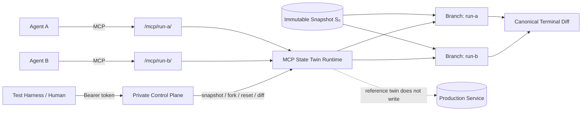

<div align="center">

<h1>MCP State Twin</h1>

<p><strong>Deterministic, forkable, stateful MCP test worlds for reproducible AI agent evaluation</strong></p>
<p>Start from the same world snapshot, let agents take different valid tool trajectories, then compare terminal state—without writing to production services.</p>

<p>
  <a href="README.md">简体中文</a> ·
  <strong>English</strong> ·
  <a href="README.ja.md">日本語</a> ·
  <a href="README.ko.md">한국어</a>
</p>

<p>
  <a href="https://github.com/augety121/MCP-State-Twin/actions/workflows/ci.yml"></a>
  <a href="LICENSE"></a>
  
  
  
</p>

<p><strong>Fork the tool world, not production.</strong></p>
<p><code>snapshot</code> → <code>fork</code> → <code>act</code> → <code>assert</code> → <code>diff</code></p>

</div>

> [!IMPORTANT]
> **Development Preview · `0.1.0-dev` · no tagged release · not production-ready.**
> Current claims are bounded by [Implementation Status](docs/IMPLEMENTATION-STATUS.md), the RFCs, accepted ADRs, specifications, and executable test evidence. Roadmap items are not presented as current features.

<p align="center">
  <a href="#quick-start"><strong>Quick start</strong></a> ·
  <a href="#how-it-works-in-30-seconds">How it works</a> ·
  <a href="#current-status">Status</a> ·
  <a href="#twinspec">TwinSpec</a> ·
  <a href="#architecture-and-security-boundaries">Security</a> ·
  <a href="#documentation-map">Docs</a>
</p>

<table>
<tr>
<td width="25%" align="center"><strong>Reproducible</strong><br><sub>Start from the same immutable snapshot</sub></td>
<td width="25%" align="center"><strong>Forkable</strong><br><sub>Give each evaluation an isolated branch</sub></td>
<td width="25%" align="center"><strong>Stateful</strong><br><sub>Preserve real cross-call state transitions</sub></td>
<td width="25%" align="center"><strong>Comparable</strong><br><sub>Score terminal state with assertions and canonical diffs</sub></td>
</tr>
</table>

## What is MCP State Twin?

MCP State Twin is an experimental open-source environment layer for AI agent evaluation. It puts **deterministic, forkable, stateful test worlds** behind Model Context Protocol (MCP) tools so multiple evaluation runs can start from the same immutable snapshot, take different valid tool trajectories, and compare terminal world state.

The goal is not to make the model deterministic. The goal is to make **the external world the model acts on reproducible, isolated, forkable, and comparable**.

| Dimension | MCP State Twin approach |
|---|---|
| Reproducible starts | Multiple runs begin from the same immutable snapshot |
| State isolation | Each fork evolves independently |
| Tool interface | Provider-neutral MCP tool surface |
| Evaluation | Compare terminal state, declared invariants, and canonical diffs instead of requiring identical trajectories |
| Environment determinism | A fixed environment identity plus ordered tool calls yields replayable structured results and a final state digest |
| Production side effects | The reference twin executes against isolated simulated state rather than writing to production services |
| Current reference fidelity | `L1` · `unverified` · `unbound` |
| Current storage | SQLite with versioned database identity and transactional transitions |

### What it is not

MCP State Twin is **not**:

- an AGI system or model runtime;
- an agent framework, planner, or orchestration framework;
- a memory system or RAG service;
- a claim of perfect equivalence to an upstream service;
- an automatic guarantee of compatibility with ChatGPT, the OpenAI API, Claude, Claude Code, or another host;
- an Internet-ready production service.

“Twin” means a **declared, reviewable behavior model with explicit evidence boundaries**, not an unlimited claim that the simulated world is identical to production.

---

## Quick start

### Requirements

- Go 1.26.x
- Git

### 1. Clone and validate the reference TwinSpec

```bash
git clone https://github.com/augety121/MCP-State-Twin.git
cd MCP-State-Twin

go mod download

go run ./cmd/statetwin validate \
  --spec examples/issue-tracker/twin.yaml
```

### 2. Initialize a world and create the base snapshot

```bash
go run ./cmd/statetwin init \
  --spec examples/issue-tracker/twin.yaml \
  --fixture examples/issue-tracker/state.json \
  --db demo.db \
  --branch main \
  --snapshot base
```

### 3. Fork the same snapshot twice

```bash
go run ./cmd/statetwin fork --db demo.db --snapshot base --branch run-a
go run ./cmd/statetwin fork --db demo.db --snapshot base --branch run-b
```

### 4. Take different valid trajectories

```bash
go run ./cmd/statetwin call \
  --spec examples/issue-tracker/twin.yaml \
  --db demo.db \
  --branch run-a \
  --tool create_issue \
  --input '{"owner":"octo","repository":"demo","title":"Fork A","body":"Created only in A"}'

go run ./cmd/statetwin call \
  --spec examples/issue-tracker/twin.yaml \
  --db demo.db \
  --branch run-b \
  --tool close_issue \
  --input '{"owner":"octo","repository":"demo","number":1}'
```

### 5. Compare terminal worlds

```bash
go run ./cmd/statetwin diff \
  --db demo.db \
  --before run-a \
  --after run-b
```

The diff uses stable JSON Pointer paths. Object keys containing `/` are escaped according to JSON Pointer rules, so `octo/demo#1` appears as `octo~1demo#1`.

### What this demo proves

It does not prove that two agents take the same path. It demonstrates that:

- both runs can start from the same world state;
- branch mutations remain isolated;
- tool calls produce real cross-call state transitions;
- terminal worlds can be compared through a canonical diff.

---

## How it works in 30 seconds



A typical evaluation looks like this:

1. initialize a world from a fixed fixture;
2. create an immutable snapshot;
3. fork multiple isolated branches from that snapshot;
4. let different agents, prompts, or models call the same MCP tool surface on their own branches;
5. score terminal state, state assertions, invariants, and canonical diffs;
6. do **not** require every run to take the same tool trajectory.

> [!NOTE]
> **The environment is deterministic; the language model is not.** Different model decisions are expected. State Twin makes those decisions happen inside worlds that can be reproduced and compared.

---

## Why this exists

Serious tool-using agent evaluation needs more than plausible JSON.

An issue-tracker agent might read an issue, add a comment, retry after an ambiguous timeout, read the issue again, and close it only if the expected state exists. **Every call changes what later calls should observe.**

Common approaches solve related but different problems:

| Approach | Primary strength | Boundary for agent evaluation |
|---|---|---|
| Record/replay | Reproduce a previously captured path | A new model may take a valid path that was never recorded |
| Static MCP mock | Isolate a client and return controlled data | Cross-call state, constraints, idempotency, and failure semantics may be incomplete |
| Hand-built benchmark sandbox | Evaluate one curated task collection | Reuse for a developer-owned tool surface is not the primary abstraction |
| Live test/production service | Exercise real behavior | Side effects, rate limits, cost, shared-state pollution, and irreproducible starts |
| **MCP State Twin** | Execute explicit transitions on forkable world state | Fidelity is limited to behavior that has been modeled and validated |

Record/replay is planned as the `L0` fidelity mode. It is complementary rather than something State Twin needs to displace.

---

## Current status

**Development preview (`0.1.0-dev`) · no tagged release · not production-ready.**

### Capability overview

| Capability | Status | Boundary |
|---|---:|---|
| Strict TwinSpec `v1alpha1` parsing and structural validation | ✅ | Includes hermetic JSON Schema 2020-12 compilation |
| Canonical spec / MCP surface / world-state digests | ✅ | SHA-256 |
| Upstream binding admission | ✅ | Fails closed on surface mismatch |
| SQLite atomic transitions and audit | ✅ | Versioned database identity and storage schema |
| Immutable snapshot / fork / reset / diff | ✅ | Isolated branch state |
| Stateless Streamable HTTP MCP data plane | ✅ | Official Go SDK |
| Separate HTTP control plane | ✅ | Bearer token; isolated from the data plane |
| Issue-tracker reference twin | ✅ | 6 tools; synthetic; `L1/unverified/unbound` |
| Scenario `v1alpha1` runner | ✅ | Bounded scripted scenario; not live model evaluation |
| Live OpenAI / ChatGPT / Claude smoke tests | ❌ not verified | No host-compatibility claim |
| Deterministic fault injection / virtual-clock advancement | 🧪 Partial | Private clock and two fault transaction phases implemented; remaining scheduler/fault semantics are not |
| Recorder / cassette replay / trace redaction | ⏳ | Not implemented |
| Differential validation / L2 promotion | ⏳ | Not complete |
| Data-plane auth / TLS / remote multi-tenancy | ⏳ | Current build should remain local/loopback |

<details>
<summary><strong>Expand: implemented and exercised capabilities</strong></summary>

- strict TwinSpec `v1alpha1` YAML decoding and structural validation;
- hermetic JSON Schema 2020-12 input/output compilation;
- canonical SHA-256 digests for specs, MCP tool surfaces, and world state;
- upstream binding admission that fails closed on mismatched `current`, `drifted`, or `unknown` surfaces;
- CEL expressions limited to 4,096 UTF-8 bytes and bounded by an evaluation cost limit, for preconditions, effects, queries, postconditions, and global invariants;
- SQLite-backed atomic transitions, versioned database identity, tool-call audit, and transactional control-operation audit;
- immutable logical snapshots, isolated forks, reset, and canonical state diff;
- stateless Streamable HTTP MCP data plane through the official Go SDK;
- separately authenticated HTTP control plane;
- six-tool issue-tracker reference twin with synthetic state;
- unit, deterministic replay, MCP HTTP, authorization, output-rollback, migration-refusal, and 100-fork isolation tests;
- pinned official MCP conformance checks for initialize, ping, tools-list, and JSON Schema 2020-12;
- bounded TwinSpec/CEL fuzz targets plus secret-policy and loopback-only hermetic CI gates;
- a tested CLI loop: initialize → snapshot → fork twice → mutate → terminal diff;
- bounded Scenario `v1alpha1` runner with deterministic environment identity, ordered tool traces, JSON Pointer state assertions, and canonical state diff.
- bounded branch-local fault plans for `before-validation` and `after-commit-before-response`, with a stable plan digest, transactional counters, and fault-event audit.

</details>

<details>
<summary><strong>Expand: not implemented or not verified</strong></summary>

- recorder, cassette replay, trace redaction, or automatic upstream surface inspection/refresh;
- remaining deterministic fault phases, scheduler, deterministic entropy, idempotency collapse, crash/cancellation, and eventual consistency; the private clock and two fault phases are implemented;
- live ChatGPT, OpenAI API, Claude, or Claude Code smoke tests;
- evidence-derived host compatibility reports or a provider harness;
- differential validation or an L2 fidelity promotion workflow;
- data-plane authentication, TLS, remote multi-tenancy, or a security audit.

</details>

See [Implementation Status](docs/IMPLEMENTATION-STATUS.md) for evidence and exact partial boundaries. **Roadmap items are not presented as current features.**

---

## Run a reproducible scenario

Execute the bundled state-scored bounded scenario:

```bash
go run ./cmd/statetwin scenario \
  --spec examples/issue-tracker/twin.yaml \
  --fixture examples/issue-tracker/state.json \
  --scenario examples/issue-tracker/scenario-close-issue.yaml
```

The command exits non-zero on an unexpected error class or failed assertion. Its JSON report includes:

- environment digest;
- ordered tool trace;
- initial and terminal state digests;
- assertion evidence;
- canonical state diff.

The current runner identifies itself as `scripted-scenario`. **It is not presented as a live Codex, OpenAI, Claude, or other model evaluation.**

> [!WARNING]
> Scenario reports contain tool inputs and results. Use synthetic fixtures only; do not commit reports containing credentials, production traces, or personal data.

---

## Run the MCP server

### Set the control-plane token

Bash / zsh:

```bash
export STATETWIN_CONTROL_TOKEN='replace-with-a-local-secret'
```

PowerShell:

```powershell
$env:STATETWIN_CONTROL_TOKEN = 'replace-with-a-local-secret'
```

### Start the runtime

```bash
go run ./cmd/statetwin serve \
  --spec examples/issue-tracker/twin.yaml \
  --fixture examples/issue-tracker/state.json \
  --db demo.db
```

Default endpoints:

| Plane | Endpoint | Visible operations |
|---|---|---|
| Agent data plane | `http://127.0.0.1:8090/mcp/main` | Modeled business tools only |
| Private control plane | `http://127.0.0.1:8091/v1` | Branch state, snapshot, fork, reset, diff, forward-only clock, bounded fault plans/events |

The branch ID is part of the MCP URL rather than an extra model-visible tool argument, keeping tool input schemas identical across branches.

The current fault preview supports only two transaction-tested phases. Send the following body to the private control plane with `Authorization: Bearer $STATETWIN_CONTROL_TOKEN`:

```json
{
  "id": "lose-close-response",
  "branch": "main",
  "tool": "close_issue",
  "phase": "after-commit-before-response",
  "errorClass": "TIMEOUT_AFTER_EFFECT",
  "message": "synthetic response loss",
  "repeatCount": 1,
  "expectedHeadVersion": 0
}
```

After `POST /v1/faults`, a matching call commits its business state before returning the deterministic error to the agent. The other supported combination is `before-validation` with `RATE_LIMITED` or `TIMEOUT_BEFORE_EFFECT`; it does not invoke the transition callback. See [SPEC-0008](docs/SPEC-0008-DETERMINISTIC-FAULTS.md) for the exact boundary.

> [!WARNING]
> **The current data plane has no authentication or TLS.** Both servers bind to loopback by default and should remain local. The control token is only one development safeguard; it does not make this build safe for Internet exposure.

---

## Reference twin

The bundled issue-tracker world exposes six agent-visible business tools:

| Tool | Purpose |
|---|---|
| `get_repository` | Read repository state |
| `list_issues` | List issues |
| `get_issue` | Read one issue |
| `create_issue` | Create an issue |
| `add_comment` | Add a comment |
| `close_issue` | Close an existing open issue |

Snapshot, fork, reset, diff, state inspection, and future fault controls **are not MCP tools** and do not appear in `tools/list`. Evaluation controls belong to the separate control plane rather than hidden agent-visible tools.

> [!CAUTION]
> The current reference twin uses synthetic data, has fidelity `L1`, status `unverified`, and is `unbound` to any upstream service. **It must not be described as a GitHub-equivalent environment.**

---

## TwinSpec

TwinSpec is a versioned, reviewable, executable contract for a modeled tool world. A tool is more than `function(args) -> JSON`:

```text
tool behavior = input contract
              + reads and preconditions
              + deterministic state effects
              + postconditions and global invariants
              + structured result or typed error
              + time and idempotency semantics
```

Excerpt from the executable reference spec:

```yaml
apiVersion: statetwin.dev/v1alpha1
kind: Twin

metadata:
  name: issue-tracker
  upstream:
    protocol: mcp
    status: unbound
  fidelity:
    level: L1
    status: unverified

clock:
  mode: virtual
  initial: "2026-08-01T00:00:00Z"

state:
  entities:
    repository:
      key: [owner, name]
    issue:
      key: [repository, number]

tools:
  - name: close_issue
    description: Close an existing open issue in the isolated simulated repository.
    preconditions:
      - expr: "state.entities.issue[input.owner + '/' + input.repository + '#' + string(input.number)].state == 'open'"
        code: CONFLICT
        message: issue is already closed
    effects:
      - op: update
        entity: issue
        key: "input.owner + '/' + input.repository + '#' + string(input.number)"
        merge: true
        value: "{'state': 'closed', 'closedAt': clock}"
```

See [examples/issue-tracker/twin.yaml](examples/issue-tracker/twin.yaml) for the complete file.

<details>
<summary><strong>Expression boundary</strong></summary>

TwinSpec expressions use `cel-go`:

- source text is limited to 4,096 UTF-8 bytes;
- expressions are compiled at load time;
- evaluation uses a cost limit of 10,000;
- expressions receive only JSON-shaped `input`, `state`, `vars`, `item`, `clock`, and `call_index` variables;
- no filesystem, process, network, reflection, or arbitrary Go functions are registered;
- native extensions are not supported in `v1alpha1`.

</details>

<details>
<summary><strong>JSON Schema boundary</strong></summary>

Tool inputs and successful outputs are compiled and validated as JSON Schema Draft 2020-12 with format assertions enabled. Local `$defs` and fragments are supported; `$ref` values that require external network or filesystem resources fail at startup.

An invalid declared successful output rolls back the transition and returns `INTERNAL_TWIN_ERROR`.

</details>

### Current effect operations

| Operation | Semantics |
|---|---|
| `allocate` | Increment a named deterministic sequence and bind the result to `vars` |
| `insert` | Insert one keyed entity; conflict if it exists |
| `update` | Replace or merge one keyed entity; fail if missing |
| `delete` | Delete one keyed entity; fail if missing |

---

## Determinism contract

The environment identity can be conceptualized as:

```text
E = (runtime version,
     TwinSpec digest,
     snapshot digest,
     scenario seed,
     ordered tool calls)

execute(E) -> (ordered structured results, final state digest)
```

Current code virtualizes state allocation and time exposed to expressions. Deterministic replay tests execute the same call corpus on separate branches and compare transition results and final state.

### What “deterministic” means

- the same controlled environment plus the same ordered tool calls should produce replayable environment results;
- multiple evaluation runs can start from the same immutable snapshot;
- branch state, terminal state, and canonical digests can be compared consistently.

### What it does not mean

- the LLM must select the same tools;
- different models or prompts must produce the same trajectory;
- an L1 twin is behaviorally equivalent to the real upstream service;
- an untested host is automatically compatible.

---

## Error and transaction semantics

Normal tool transitions run inside one SQLite transaction:

```text
load branch head
  -> validate input
  -> evaluate preconditions
  -> apply effects to an isolated working state
  -> evaluate query, postconditions, and global invariants
  -> commit state and audit record atomically
```

Failed domain outcomes keep the prior state digest and still append a tool-call audit record. Implemented canonical error classes include:

- `INVALID_INPUT`
- `PRECONDITION_FAILED`
- `NOT_FOUND`
- `CONFLICT`
- `INVARIANT_VIOLATION`
- `UNMODELED_BEHAVIOR`
- `INTERNAL_TWIN_ERROR`

Timeout-before-effect, timeout-after-effect, partial-effect, rate-limit, and eventual-consistency faults remain **specified but not implemented**.

SQLite files carry the State Twin application ID and an explicit schema version. Snapshots persist that storage schema version and bind it into their IDs; foreign databases and versions newer than the runtime are rejected.

---

## Fidelity levels

“Twin” does not mean “perfect copy.” Fidelity must be **declared, bounded, and supported by evidence**.

| Level | Meaning | Intended use |
|---|---|---|
| `L0` — Cassette replay | Match recorded interactions | Exact-path smoke / regression tests |
| `L1` — Stateful template | Explicit entities and reviewed basic transitions | Development and exploratory workflow tests |
| `L2` — Contract-backed | Human-reviewed rules, invariants, differential tests, upstream fingerprint | CI/evaluation within declared coverage |
| `L3` — Native/reference | Shared or domain-provided reference logic | High-fidelity domain simulation |

Generated or inferred behavior cannot promote itself to L2/L3. **The current reference twin is `L1 + unverified`.**

---

## Architecture and security boundaries

The project intentionally separates two trust domains:

| | Agent Data Plane | Simulation Control Plane |
|---|---|---|
| Used by | Agent under test | Test harness / human operator |
| Default address | `127.0.0.1:8090` | `127.0.0.1:8091` |
| Purpose | MCP business tools | Branch state / snapshot / fork / reset / diff |
| Branch selection | MCP URL | Control operation parameters |
| Authentication | **None currently** | Independent bearer token |
| Evaluation controls visible to agent | No | N/A |

Key boundaries:

- the agent sees only business tools declared by TwinSpec;
- expected state, snapshot, fork, reset, and diff are not disguised as MCP tools;
- prompt instructions are **not** an authorization boundary;
- privileged control operations write a separate control-audit row transactionally with the mutation;
- bearer tokens and HTTP headers are not recorded in that audit data;
- the current build should remain loopback-local and use synthetic fixtures.

---

## MCP and model providers

The core integrates with **MCP**, not with model-provider SDKs. This is deliberate: the project can provide one tool world without claiming that different models select the same tools or follow the same trajectory.

The automated integration test uses the official Go SDK as server and client over stateless Streamable HTTP. Linux CI also runs the pinned official MCP conformance framework `v0.1.16` for initialize, ping, tools-list, and JSON Schema 2020-12. That framework currently exercises protocol versions through `2025-11-25`; this does **not** prove every feature of the `2026-07-28` design baseline.

> [!NOTE]
> The repository has **not completed live ChatGPT, OpenAI API, Claude, or Claude Code smoke tests**. The README therefore does not present provider-specific integrations as verified. A host should be listed as verified only after a versioned smoke run produces the evidence required by [SPEC-0006](docs/SPEC-0006-HOST-COMPATIBILITY-AND-MODEL-EVALUATION.md).

Design references:

- [MCP Specification 2026-07-28](https://modelcontextprotocol.io/specification/2026-07-28)
- [Official MCP Go SDK](https://github.com/modelcontextprotocol/go-sdk)
- [OpenAI: ChatGPT Developer mode](https://developers.openai.com/api/docs/guides/developer-mode)
- [OpenAI: MCP servers for plugins and API integrations](https://developers.openai.com/api/docs/mcp)
- [Anthropic: MCP connector](https://platform.claude.com/docs/en/agents-and-tools/mcp-connector)

---

## CLI

```text
statetwin validate   validate structure, CEL, and print the spec digest
statetwin init       initialize a branch and optional immutable snapshot
statetwin call       execute one tool directly against a branch
statetwin state      inspect canonical branch state
statetwin snapshot   create an immutable logical snapshot
statetwin fork       create an isolated branch from a snapshot
statetwin diff       compare two branch states
statetwin scenario   execute a bounded scripted scenario and assertions
statetwin protocols   print pinned MCP wire-evidence profiles
statetwin serve      run separate MCP data and HTTP control planes
statetwin version    print the development version
```

CLI output is structured JSON except for server logs and fatal diagnostics.

---

## Test and build

```bash
gofmt -w .
go vet ./...
go test ./...
go test -race ./...
go build ./cmd/statetwin
```

Environment and CI status can change as development continues. Prefer CI, [Implementation Status](docs/IMPLEMENTATION-STATUS.md), and the corresponding executable tests over stale prose when evaluating current evidence.

---

## Documentation map

For a first read, the suggested path is:

1. **[Implementation Status](docs/IMPLEMENTATION-STATUS.md)** — what is actually implemented now;
2. **[RFC-0001](docs/RFC-0001.md)** — product boundary, hard invariants, and architecture;
3. **[TwinSpec Core](docs/SPEC-0001-TWINSPEC-CORE.md)** — TwinSpec `v1alpha1` data model;
4. **[Runtime Semantics](docs/SPEC-0002-RUNTIME-SEMANTICS.md)** — determinism, transactions, snapshots, and errors;
5. **[Roadmap](docs/ROADMAP.md)** — ordered next steps and exit criteria.

### Specifications

- [SPEC-0001 — TwinSpec Core](docs/SPEC-0001-TWINSPEC-CORE.md)
- [SPEC-0002 — Runtime Semantics](docs/SPEC-0002-RUNTIME-SEMANTICS.md)
- [SPEC-0003 — MCP Boundaries and Compatibility](docs/SPEC-0003-MCP-BOUNDARIES-AND-COMPATIBILITY.md)
- [SPEC-0004 — Evidence, Fidelity and Release](docs/SPEC-0004-EVIDENCE-FIDELITY-AND-RELEASE.md)
- [SPEC-0005 — Scenario and Report](docs/SPEC-0005-SCENARIO-AND-REPORT.md)
- [SPEC-0006 — Host Compatibility and Model Evaluation](docs/SPEC-0006-HOST-COMPATIBILITY-AND-MODEL-EVALUATION.md)
- [Phase 0 MCP 2026 Gap Matrix](docs/PHASE-0-MCP-2026-GAP-MATRIX.md)
- [vNext Adoption Record](docs/VNEXT-ADOPTION.md)
- [vNext SPEC Pack Traceability Matrix](docs/VNEXT-TRACEABILITY.md)
- [SPEC-0007 — Virtual Time Boundary](docs/SPEC-0007-VIRTUAL-TIME-ENTROPY-SCHEDULER.md)
- [SPEC-0008 — Deterministic Fault Preview](docs/SPEC-0008-DETERMINISTIC-FAULTS.md)
- [SPEC-0012 — Storage/Concurrency/Recovery](docs/SPEC-0012-STORAGE-CONCURRENCY-RECOVERY.md)

<details>
<summary><strong>Complete RFC / ADR / evidence index</strong></summary>

### RFCs

- [RFC-0001](docs/RFC-0001.md) — product boundary, hard invariants, architecture, semantics, and release gates
- [RFC-0002](docs/RFC-0002-V0.1-RELEASE-PROFILE.md) — v0.1 normative release profile, limits, traceability, and gates

### ADRs

- [ADR-0001](docs/ADR-0001-PROTOCOL-BASELINE.md) — MCP protocol baseline and provider neutrality
- [ADR-0002](docs/ADR-0002-CONTROL-PLANE-ISOLATION.md) — data/control-plane isolation
- [ADR-0003](docs/ADR-0003-EXPRESSION-ENGINE.md) — bounded CEL expressions
- [ADR-0004](docs/ADR-0004-STORAGE-AND-SNAPSHOTS.md) — SQLite and logical snapshot strategy
- [ADR-0005](docs/ADR-0005-CANONICAL-JSON.md) — alpha canonical digest contract
- [ADR-0006](docs/ADR-0006-JSON-SCHEMA-VALIDATION.md) — hermetic JSON Schema 2020-12 validation
- [ADR-0007](docs/ADR-0007-STORAGE-IDENTITY-AND-CONTROL-AUDIT.md) — SQLite identity/version and privileged-operation audit
- [ADR-0008](docs/ADR-0008-MCP-TOOL-SURFACE-DIGEST.md) — canonical model-facing MCP surface and fail-closed binding
- [ADR-0009](docs/ADR-0009-OPERATIONAL-LOGGING-BOUNDARY.md) — operational log redaction boundary
- [ADR-0010](docs/ADR-0010-SCENARIO-ARTIFACTS.md) — bounded scenario artifacts and scripted evidence reports
- [ADR-0011](docs/ADR-0011-HEAD-VERSION-AND-VIRTUAL-CLOCK.md) — monotonic branch heads and private virtual-clock preview
- [ADR-0012](docs/ADR-0012-DETERMINISTIC-FAULT-PREVIEW.md) — branch-local bounded deterministic fault preview

### Evidence / research

- [Failure Mode Matrix](docs/FAILURE-MODE-MATRIX.md) — design risks and required responses; not a test-completion report
- [v0.1 P0 Traceability](docs/V0.1-P0-TRACEABILITY.md) — P0-by-P0 evidence, exclusions, and stable-release blockers
- [Competitive Landscape](docs/COMPETITIVE-LANDSCAPE.md) — dated prior-art screen and rejected directions
- [Roadmap](docs/ROADMAP.md) — ordered phases and exit criteria

</details>

The RFCs and accepted ADRs define **intended semantics**. Implementation Status and executable tests define what the current development build can **honestly claim today**.

---

## Roadmap to the first tagged release

Current release-critical work includes:

1. virtual-time advancement and deterministic scheduled faults;
2. crash kill-points and tagged-database migration fixtures;
3. upstream surface inspector and automated refresh;
4. continued proof of hermetic / egress-deny integration gates;
5. pinned official MCP conformance scenarios for the tools-first subset;
6. live OpenAI/ChatGPT and Anthropic/Claude smoke-test matrix;
7. recorder redaction tests if recorder enters v0.1 scope;
8. differential validation and an honest L2 coverage report;
9. a second independent stateful reference domain;
10. complete P0/P1 failure-mode traceability.

Cloud hosting, registries, marketplaces, and automatic production mirroring are **not first-release priorities**.

---

## FAQ

<details>
<summary><strong>Is this a full GitHub simulator?</strong></summary>

No. The current issue-tracker reference twin is synthetic, `L1`, `unverified`, and `unbound`. It represents explicitly modeled behavior only and must not be described as GitHub-equivalent.

</details>

<details>
<summary><strong>Does “deterministic” mean the model gives the same answer every time?</strong></summary>

No. Determinism describes the controlled tool world. The model can still choose different tools, arguments, and trajectories. Evaluation starts from the same snapshot and compares terminal state and declared invariants.

</details>

<details>
<summary><strong>Can I claim verified ChatGPT or Claude compatibility today?</strong></summary>

Not from the current README baseline. The design is provider-neutral, but live provider smoke tests have not been completed, so those hosts should not be presented as verified.

</details>

<details>
<summary><strong>Can I expose the current server to the public Internet?</strong></summary>

It should not be exposed publicly in its current form. The data plane has no authentication or TLS; the intended safety posture is loopback-local use with synthetic fixtures.

</details>

---

## Contributing and security

Read [CONTRIBUTING.md](CONTRIBUTING.md) before changing protocol, TwinSpec, canonicalization, or trust-boundary semantics.

Read [SECURITY.md](SECURITY.md) before using anything other than synthetic local fixtures. Do not commit:

- credentials or secrets;
- production traces;
- personal data;
- third-party recordings you do not have the right to redistribute.

---

## Positioning and research caveat

The project does **not** claim to be the first mock server, stateful sandbox, service-virtualization system, or digital twin.

The narrower hypothesis is that agent engineering benefits from a reusable combination of:

- an MCP-compatible agent-facing surface;
- explicit state-transition contracts;
- forkable deterministic world state;
- strict control-plane isolation;
- declared fidelity and differential validation.

The prior-art search is documented in [Competitive Landscape](docs/COMPETITIVE-LANDSCAPE.md). A dated public search cannot prove that no similar public, private, or unindexed project exists. Positioning should change if stronger prior art appears.

---

## License

MCP State Twin is licensed under the **MIT License**. See [LICENSE](LICENSE) for the complete license text.

Any license summary in this README is explanatory only; the standard MIT text in `LICENSE` controls.
