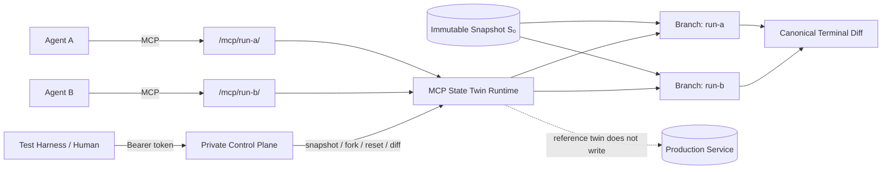

<div align="center">

<h1>MCP State Twin</h1>

<p><strong>Deterministic, forkable, stateful MCP test worlds for reproducible AI agent evaluation</strong></p>
<p>Start from the same world snapshot, let agents take different valid tool trajectories, then compare terminal state—without writing to production services.</p>

<p>
  <a href="README.md">简体中文</a> ·
  <strong>English</strong> ·
  <a href="README.ja.md">日本語</a> ·
  <a href="README.ko.md">한국어</a>
</p>

<p>
  <a href="https://github.com/augety121/MCP-State-Twin/actions/workflows/ci.yml"></a>
  <a href="LICENSE"></a>
  
  
  
</p>

<p><strong>Fork the tool world, not production.</strong></p>
<p><code>snapshot</code> → <code>fork</code> → <code>act</code> → <code>assert</code> → <code>diff</code></p>

</div>

> [!IMPORTANT]
> **Development Preview · `0.1.0-dev` · latest prerelease `v0.1.0-alpha.1` · not production-ready.**
> Current claims are bounded by [Implementation Status](docs/IMPLEMENTATION-STATUS.md), the RFCs, accepted ADRs, specifications, and executable test evidence. Roadmap items are not presented as current features.

<p align="center">
  <a href="#quick-start"><strong>Quick start</strong></a> ·
  <a href="#how-it-works-in-30-seconds">How it works</a> ·
  <a href="#current-status">Status</a> ·
  <a href="#twinspec">TwinSpec</a> ·
  <a href="#architecture-and-security-boundaries">Security</a> ·
  <a href="#documentation-map">Docs</a>
</p>

<table>
<tr>
<td width="25%" align="center"><strong>Reproducible</strong><br><sub>Start from the same immutable snapshot</sub></td>
<td width="25%" align="center"><strong>Forkable</strong><br><sub>Give each evaluation an isolated branch</sub></td>
<td width="25%" align="center"><strong>Stateful</strong><br><sub>Preserve real cross-call state transitions</sub></td>
<td width="25%" align="center"><strong>Comparable</strong><br><sub>Score terminal state with assertions and canonical diffs</sub></td>
</tr>
</table>

## What is MCP State Twin?

MCP State Twin is an experimental open-source environment layer for AI agent evaluation. It puts **deterministic, forkable, stateful test worlds** behind Model Context Protocol (MCP) tools so multiple evaluation runs can start from the same immutable snapshot, take different valid tool trajectories, and compare terminal world state.

The goal is not to make the model deterministic. The goal is to make **the external world the model acts on reproducible, isolated, forkable, and comparable**.

| Dimension | MCP State Twin approach |
|---|---|
| Reproducible starts | Multiple runs begin from the same immutable snapshot |
| State isolation | Each fork evolves independently |
| Tool interface | Provider-neutral MCP tool surface |
| Evaluation | Compare terminal state, declared invariants, and canonical diffs instead of requiring identical trajectories |
| Environment determinism | A fixed environment identity plus ordered tool calls yields replayable structured results and a final state digest |
| Production side effects | The reference twin executes against isolated simulated state rather than writing to production services |
| Current reference fidelity | `L1` · `unverified` · `unbound` |
| Current storage | SQLite with versioned database identity and transactional transitions |

### What it is not

MCP State Twin is **not**:

- an AGI system or model runtime;
- an agent framework, planner, or orchestration framework;
- a memory system or RAG service;
- a claim of perfect equivalence to an upstream service;
- an automatic guarantee of compatibility with ChatGPT, the OpenAI API, Claude, Claude Code, or another host;
- an Internet-ready production service.

“Twin” means a **declared, reviewable behavior model with explicit evidence boundaries**, not an unlimited claim that the simulated world is identical to production.

---

## Quick start

### Requirements

- Go 1.26.x
- Git

### 1. Clone and validate the reference TwinSpec

```bash
git clone https://github.com/augety121/MCP-State-Twin.git
cd MCP-State-Twin

go mod download

go run ./cmd/statetwin validate \
  --spec examples/issue-tracker/twin.yaml
```

### 2. Initialize a world and create the base snapshot

```bash
go run ./cmd/statetwin init \
  --spec examples/issue-tracker/twin.yaml \
  --fixture examples/issue-tracker/state.json \
  --db demo.db \
  --branch main \
  --snapshot base
```

### 3. Fork the same snapshot twice

```bash
go run ./cmd/statetwin fork --db demo.db --snapshot base --branch run-a
go run ./cmd/statetwin fork --db demo.db --snapshot base --branch run-b
```

### 4. Take different valid trajectories

```bash
go run ./cmd/statetwin call \
  --spec examples/issue-tracker/twin.yaml \
  --db demo.db \
  --branch run-a \
  --tool create_issue \
  --input '{"owner":"octo","repository":"demo","title":"Fork A","body":"Created only in A"}'

go run ./cmd/statetwin call \
  --spec examples/issue-tracker/twin.yaml \
  --db demo.db \
  --branch run-b \
  --tool close_issue \
  --input '{"owner":"octo","repository":"demo","number":1}'
```

### 5. Compare terminal worlds

```bash
go run ./cmd/statetwin diff \
  --db demo.db \
  --before run-a \
  --after run-b
```

The diff uses stable JSON Pointer paths. Object keys containing `/` are escaped according to JSON Pointer rules, so `octo/demo#1` appears as `octo~1demo#1`.

### What this demo proves

It does not prove that two agents take the same path. It demonstrates that:

- both runs can start from the same world state;
- branch mutations remain isolated;
- tool calls produce real cross-call state transitions;
- terminal worlds can be compared through a canonical diff.

---

## How it works in 30 seconds



A typical evaluation looks like this:

1. initialize a world from a fixed fixture;
2. create an immutable snapshot;
3. fork multiple isolated branches from that snapshot;
4. let different agents, prompts, or models call the same MCP tool surface on their own branches;
5. score terminal state, state assertions, invariants, and canonical diffs;
6. do **not** require every run to take the same tool trajectory.

> [!NOTE]
> **The environment is deterministic; the language model is not.** Different model decisions are expected. State Twin makes those decisions happen inside worlds that can be reproduced and compared.

---

## Why this exists

Serious tool-using agent evaluation needs more than plausible JSON.

An issue-tracker agent might read an issue, add a comment, retry after an ambiguous timeout, read the issue again, and close it only if the expected state exists. **Every call changes what later calls should observe.**

Common approaches solve related but different problems:

| Approach | Primary strength | Boundary for agent evaluation |
|---|---|---|
| Record/replay | Reproduce a previously captured path | A new model may take a valid path that was never recorded |
| Static MCP mock | Isolate a client and return controlled data | Cross-call state, constraints, idempotency, and failure semantics may be incomplete |
| Hand-built benchmark sandbox | Evaluate one curated task collection | Reuse for a developer-owned tool surface is not the primary abstraction |
| Live test/production service | Exercise real behavior | Side effects, rate limits, cost, shared-state pollution, and irreproducible starts |
| **MCP State Twin** | Execute explicit transitions on forkable world state | Fidelity is limited to behavior that has been modeled and validated |

Record/replay is planned as the `L0` fidelity mode. It is complementary rather than something State Twin needs to displace.

---

## Current status

**Development preview (`0.1.0-dev`) · latest public prerelease `v0.1.0-alpha.1` · not production-ready.**

### Capability overview

| Capability | Status | Boundary |
|---|---:|---|
| Strict TwinSpec `v1alpha1` parsing and structural validation | ✅ | Includes hermetic JSON Schema 2020-12 compilation |
| Canonical spec / MCP surface / world-state digests | ✅ | SHA-256 |
| Upstream binding admission | ✅ | Fails closed on surface mismatch |
| SQLite atomic transitions and audit | ✅ | Versioned database identity and storage schema |
| World-store storage compatibility | ✅ | v1/v2/v3 → v4, tagged-alpha v4 reopen, migration kill-point recovery, and zero-write foreign/future refusal; ADR-0016 local profile only |
| Immutable snapshot / fork / reset / diff | ✅ | Isolated branch state |
| Stateless Streamable HTTP MCP data plane | ✅ | Official Go SDK |
| Separate HTTP control plane | ✅ | Bearer token; isolated from the data plane |
| Issue-tracker reference twin | ✅ | 6 tools; synthetic; `L1/unverified/unbound` |
| Package-registry reference twin | ✅ | publish/yank/install/advisory flows; synthetic; `L1/unverified/unbound` |
| Scenario `v1alpha1` runner | ✅ | Bounded scripted scenario; not live model evaluation |
| Deterministic TwinBundle `v1alpha1` | ✅ development preview | Strict manifest, payload semantics, member SHA-256, path/type/size limits, reproducible ZIP; unsigned |
| Local scripted EvaluationEpisode | ✅ development preview | Single process and Scenario, closed lifecycle, digestible evidence; not a provider harness |
| Durable Episode Journal | ✅ development preview | Independent SQLite schema v2; v1-fixture migration, migration kill-point recovery, immutable requests, and terminal Evidence consistency checks |
| Remote Episode coordinator/workers | ✅ development preview | Bearer/TLS boundary, leases, heartbeats, fencing, concurrent claiming, bounded retry, and cooperative cancellation; synthetic TwinBundles only |
| Exactly-once terminal acceptance | ✅ bounded semantics | At most one matching Evidence envelope is accepted per parent Episode; **not** exactly-once provider/tool/external effects |
| HostCompatibilityReport admission | ✅ | Strict schema, bounded evidence, and credential/private-key/email pattern rejection; not a live-provider result |
| OpenAI / Anthropic provider smoke harness | 🧪 contract tested | OpenAI background/retrieve/cancel and Anthropic MCP connector mock contract tests; no dated live report yet |
| Deterministic fault injection / virtual-clock advancement | 🧪 Partial | Private clock; ordinary calls and scheduled TwinSpec actions cover two fault transaction phases; remaining fault semantics are not implemented |
| Deterministic entropy / world scheduler | ✅ bounded semantics | `sha256-ctr-v1` and private `deterministic-queue-v2`; supports one-attempt runtime-bound local TwinSpec actions (32 per step, zero cascade), not Agent/provider/external work |
| Versioned semantic resource governance | 🧪 Partial | `statetwin limits`, environment digest, and fail-closed local budgets; OS/remote quotas are not implemented |
| Conservative local execution governor | ✅ soft boundary | `local-v2` quiet default: `GOMAXPROCS=1`, 512 MiB Go-heap soft target, four in-flight requests per listener; not an OS/RSS hard quota and does not cover native/child processes |
| HTTP admission/backpressure | ✅ local boundary | independent non-queueing pool for data/control/coordinator listeners; redacted `503 SERVER_BUSY`; not distributed rate limiting or DDoS protection |
| Operational health/readiness | ✅ local control plane | authenticated `/v1/health/live` and `/v1/health/ready`; process/local-SQLite check only; never an MCP tool |
| External-effect retry / distributed HA | ⏳ | Ambiguous external commits stop at `COMMIT_UNKNOWN`; no multi-coordinator, replication, manual reconciliation, or external exactly-once claim |
| HostProfile / signed bundles | ⏳ | No supply-chain-authenticity or host-compatibility claim |
| Recorder / cassette replay / trace redaction | ⏳ | Not implemented |
| Differential validation / L2 promotion | ⏳ | Not complete |
| Data-plane auth / TLS / remote multi-tenancy | ⏳ | Current build should remain local/loopback |

<details>
<summary><strong>Expand: implemented and exercised capabilities</strong></summary>

- strict TwinSpec `v1alpha1` YAML decoding and structural validation;
- hermetic JSON Schema 2020-12 input/output compilation;
- canonical SHA-256 digests for specs, MCP tool surfaces, and world state;
- upstream binding admission that fails closed on mismatched `current`, `drifted`, or `unknown` surfaces;
- CEL expressions limited to 4,096 UTF-8 bytes and bounded by an evaluation cost limit, for preconditions, effects, queries, postconditions, and global invariants;
- SQLite-backed atomic transitions, versioned database identity, tool-call audit, and transactional control-operation audit;
- immutable logical snapshots, isolated forks, reset, and canonical state diff;
- stateless Streamable HTTP MCP data plane through the official Go SDK;
- separately authenticated HTTP control plane;
- six-tool issue-tracker reference twin with synthetic state;
- package-registry reference twin for dependency publish, yank, install, and advisory scenarios;
- unit, deterministic replay, MCP HTTP, authorization, output-rollback, migration-refusal, and 100-fork isolation tests;
- pinned official MCP conformance checks for initialize, ping, tools-list, and JSON Schema 2020-12;
- bounded TwinSpec/CEL fuzz targets plus secret-policy and loopback-only hermetic CI gates;
- a tested CLI loop: initialize → snapshot → fork twice → mutate → terminal diff;
- bounded Scenario `v1alpha1` runner with deterministic environment identity, ordered tool traces, JSON Pointer state assertions, and canonical state diff.
- deterministic TwinBundle `v1alpha1` admission with strict paths, regular-file and size checks, member SHA-256, payload semantics, and byte-for-byte reproducible ZIP output;
- local scripted EvaluationEpisode execution over declared Scenarios, with a closed lifecycle, runtime revision, complete Scenario report, and canonical evidence digest;
- optional durable local Episode Journal with independent SQLite identity/schema, request-digest binding, transactional lifecycle CAS, atomic terminal Evidence persistence, and `episode inspect`;
- fenced remote Episode coordinator with schema-v2 task/attempt lineage, one active lease, heartbeats, monotonic fencing, hermetic recovery, cooperative cancellation, and fail-closed `COMMIT_UNKNOWN`;
- provider-neutral remote worker that claims only `hermetic` tasks, runs TwinBundles through a separate HTTP control plane, and atomically submits Evidence;
- OpenAI/Anthropic smoke harness with current official API contract shapes and mock-server positive/negative tests; persisted reports contain digests, capabilities, and counts rather than tokens, raw responses, or prompts;
- bounded branch-local fault plans for `before-validation` and `after-commit-before-response`, with a stable plan digest, transactional counters, and fault-event audit.
- deterministic-world inputs: public-synthetic-seed `sha256-ctr-v1` streams and private branch-local `deterministic-queue-v2`, whose counters/complete queue state are captured by snapshot, fork, and reset.
- atomic due-signal delivery ordered by parsed UTC due time, priority, creation sequence, and ID, with a 256-event all-or-nothing ordinary-advance bound.
- scheduler liveness and inspection: at most 256 newly admitted pending events per world instant, explicit bounded `advance-next` recovery for older overfull preview queues, and 100-default/256-maximum digest-bound pages.
- runtime-bound scheduled TwinSpec actions: the private control plane validates the loaded modeled tool, input schema, and branch/spec digest; one SQLite transaction couples effect, fault, audit, terminal evidence, clock, call count, and head. `local-preview-v7` caps a step at 32 actions/256 total events, one attempt, and zero cascade.
- a versioned resource profile: input/output/state, JSON depth/member, effect/query, diff/report, and branch/snapshot limits fail closed as `RESOURCE_LIMIT` and bind to Scenario environment identity.
- a separate versioned ExecutionProfile applied before every command, defaulting to a one-slot `quiet` Go scheduler policy without claiming an OS hard quota.
- a Go heap soft target and independent HTTP listener admission; the quiet defaults are 512 MiB and four non-queued in-flight requests per listener.
- authenticated, redacted control-plane live/readiness routes that expose no branch, tool, state, database path, or driver error.
- storage compatibility evidence for v1/v2/v3 forward migration, the public alpha schema-v4 fixture, and two migration pre-commit process-exit kill-points.
- strict HostCompatibilityReport admission for immutable revisions/digests, profile-specific checks, remote deployment binding, bounded trials, and credential/private-key/email pattern rejection.

</details>

<details>
<summary><strong>Expand: not implemented or not verified</strong></summary>

- recorder, cassette replay, trace redaction, or automatic upstream surface inspection/refresh;
- remaining deterministic fault phases, idempotency collapse, crash/cancellation, and eventual consistency; the private clock, modeled entropy, signals, one-attempt local TwinSpec actions, and two fault phases are implemented;
- scheduled Agent/provider/process/external effects, recurrence, automatic retry/dead letters, and non-zero cascades;
- live ChatGPT, Claude product, or Claude Code smoke tests;
- dated OpenAI/Anthropic live reports or an evidence-derived compatibility matrix; the current environment has no provider key or public synthetic MCP endpoint;
- differential validation or an L2 fidelity promotion workflow;
- data-plane authentication, TLS, remote multi-tenancy, or a security audit.
- automatic retry for external effects, manual `COMMIT_UNKNOWN` reconciliation, multi-coordinator HA/replication, retention, HostProfile, bundle signing/registry, or provenance attestations;
- exactly-once provider inference, HTTP delivery, MCP tool execution, or arbitrary external side effects.

</details>

See [Implementation Status](docs/IMPLEMENTATION-STATUS.md) for evidence and exact partial boundaries. **Roadmap items are not presented as current features.**

---

## Run a reproducible scenario

Execute the bundled state-scored bounded scenario:

```bash
go run ./cmd/statetwin scenario \
  --spec examples/issue-tracker/twin.yaml \
  --fixture examples/issue-tracker/state.json \
  --scenario examples/issue-tracker/scenario-close-issue.yaml
```

The command exits non-zero on an unexpected error class or failed assertion. Its JSON report includes:

- environment digest;
- ordered tool trace;
- initial and terminal state digests;
- assertion evidence;
- canonical state diff.

The current runner identifies itself as `scripted-scenario`. **It is not presented as a live Codex, OpenAI, Claude, or other model evaluation.**

The second independent reference domain is a package registry:

```bash
go run ./cmd/statetwin scenario \
  --spec examples/package-registry/twin.yaml \
  --fixture examples/package-registry/state.json \
  --scenario examples/package-registry/scenario-release-lifecycle.yaml
```

It covers dependency release, yank, install, and advisory lookup, including an
explicit negative assertion that a yanked release cannot be installed. It is
synthetic, `L1/unverified/unbound`, and not an equivalent implementation of any
real package registry.

> [!WARNING]
> Scenario reports contain tool inputs and results. Use synthetic fixtures only; do not commit reports containing credentials, production traces, or personal data.

### Build a portable TwinBundle and run a local Episode

```bash
go run ./cmd/statetwin bundle build \
  --manifest examples/issue-tracker/bundle.yaml \
  --out issue-tracker.stb

go run ./cmd/statetwin bundle verify --bundle issue-tracker.stb

go run ./cmd/statetwin episode run \
  --bundle issue-tracker.stb \
  --id local-episode-001 \
  --out episode-evidence.json

go run ./cmd/statetwin episode run \
  --bundle issue-tracker.stb \
  --id durable-episode-001 \
  --journal episodes.db

go run ./cmd/statetwin episode inspect \
  --journal episodes.db \
  --id durable-episode-001
```

`bundle verify` checks both archive integrity and strict TwinSpec, fixture, and Scenario semantics. It does **not** establish publisher identity or upstream fidelity. A local Episode runs `scripted-scenario` only and never calls Codex, OpenAI, Claude, or another remote model. The Journal returns existing Evidence for an identical completed request and conflicts on the same ID with different inputs. Existing output paths are refused to prevent accidental evidence overwrite.

### Run a fenced remote Episode worker

Submit a task that permits hermetic execution only:

```bash
go run ./cmd/statetwin episode submit \
  --bundle issue-tracker.stb \
  --id remote-episode-001 \
  --journal remote-episodes.db \
  --effect-profile hermetic \
  --max-attempts 3
```

Set `STATETWIN_COORDINATOR_TOKEN`, then run the coordinator and worker in separate terminals:

```bash
go run ./cmd/statetwin episode coordinator \
  --journal remote-episodes.db \
  --addr 127.0.0.1:8092

go run ./cmd/statetwin episode worker \
  --coordinator http://127.0.0.1:8092 \
  --id worker-001 \
  --once

go run ./cmd/statetwin episode task \
  --journal remote-episodes.db \
  --id remote-episode-001
```

The worker uses a lease, heartbeats, and a fencing token. An expired hermetic attempt may be requeued within its attempt budget. A disconnected `external` attempt or an explicitly ambiguous effect becomes `COMMIT_UNKNOWN` and is not retried automatically. The coordinator is a separate control plane and never appears in agent-facing MCP `tools/list`. Non-loopback listeners require `--tls-cert` and `--tls-key`.

### Run an OpenAI / Anthropic live smoke (external credentials required)

```bash
go run ./cmd/statetwin provider smoke \
  --provider openai \
  --model YOUR_EXACT_MODEL_ID \
  --runtime-revision YOUR_EXACT_GIT_SHA \
  --mcp-url https://synthetic-mcp.example/mcp/run-a/ \
  --prompt "Use the MCP tools to inspect synthetic issue 1." \
  --out openai-smoke.json \
  --synthetic-only
```

Provider keys are read only from `OPENAI_API_KEY` or `ANTHROPIC_API_KEY`; optional MCP authorization is read from `STATETWIN_MCP_AUTHORIZATION`. Reports persist digests, capability fields, tool-discovery/call counts, and terminal status rather than tokens, prompts, raw responses, or provider error bodies. A manually dispatched `provider-smoke` workflow is also included and requires a public HTTPS synthetic MCP endpoint. **A harness is not a passed live test and does not establish ChatGPT or Claude product compatibility.**

---

## Run the MCP server

### Set the control-plane token

Bash / zsh:

```bash
export STATETWIN_CONTROL_TOKEN='replace-with-a-local-secret'
```

PowerShell:

```powershell
$env:STATETWIN_CONTROL_TOKEN = 'replace-with-a-local-secret'
```

### Start the runtime

```bash
go run ./cmd/statetwin serve \
  --spec examples/issue-tracker/twin.yaml \
  --fixture examples/issue-tracker/state.json \
  --db demo.db
```

Default endpoints:

| Plane | Endpoint | Visible operations |
|---|---|---|
| Agent data plane | `http://127.0.0.1:8090/mcp/main` | Modeled business tools only |
| Private control plane | `http://127.0.0.1:8091/v1` | Branch state, snapshot, fork, reset, diff, forward-only clock, bounded fault plans/events |

The branch ID is part of the MCP URL rather than an extra model-visible tool argument, keeping tool input schemas identical across branches.

The current fault preview supports only two transaction-tested phases. Send the following body to the private control plane with `Authorization: Bearer $STATETWIN_CONTROL_TOKEN`:

```json
{
  "id": "lose-close-response",
  "branch": "main",
  "tool": "close_issue",
  "phase": "after-commit-before-response",
  "errorClass": "TIMEOUT_AFTER_EFFECT",
  "message": "synthetic response loss",
  "repeatCount": 1,
  "expectedHeadVersion": 0
}
```

After `POST /v1/faults`, a matching call commits its business state before returning the deterministic error to the agent. The other supported combination is `before-validation` with `RATE_LIMITED` or `TIMEOUT_BEFORE_EFFECT`; it does not invoke the transition callback. See [SPEC-0008](docs/SPEC-0008-DETERMINISTIC-FAULTS.md) for the exact boundary.

> [!WARNING]
> **The current data plane has no authentication or TLS.** Both servers bind to loopback by default and should remain local. The control token is only one development safeguard; it does not make this build safe for Internet exposure.

---

## Reference twin

The bundled issue-tracker world exposes six agent-visible business tools:

| Tool | Purpose |
|---|---|
| `get_repository` | Read repository state |
| `list_issues` | List issues |
| `get_issue` | Read one issue |
| `create_issue` | Create an issue |
| `add_comment` | Add a comment |
| `close_issue` | Close an existing open issue |

Snapshot, fork, reset, diff, state inspection, and future fault controls **are not MCP tools** and do not appear in `tools/list`. Evaluation controls belong to the separate control plane rather than hidden agent-visible tools.

> [!CAUTION]
> The current reference twin uses synthetic data, has fidelity `L1`, status `unverified`, and is `unbound` to any upstream service. **It must not be described as a GitHub-equivalent environment.**

---

## TwinSpec

TwinSpec is a versioned, reviewable, executable contract for a modeled tool world. A tool is more than `function(args) -> JSON`:

```text
tool behavior = input contract
              + reads and preconditions
              + deterministic state effects
              + postconditions and global invariants
              + structured result or typed error
              + time and idempotency semantics
```

Excerpt from the executable reference spec:

```yaml
apiVersion: statetwin.dev/v1alpha1
kind: Twin

metadata:
  name: issue-tracker
  upstream:
    protocol: mcp
    status: unbound
  fidelity:
    level: L1
    status: unverified

clock:
  mode: virtual
  initial: "2026-08-01T00:00:00Z"

state:
  entities:
    repository:
      key: [owner, name]
    issue:
      key: [repository, number]

tools:
  - name: close_issue
    description: Close an existing open issue in the isolated simulated repository.
    preconditions:
      - expr: "state.entities.issue[input.owner + '/' + input.repository + '#' + string(input.number)].state == 'open'"
        code: CONFLICT
        message: issue is already closed
    effects:
      - op: update
        entity: issue
        key: "input.owner + '/' + input.repository + '#' + string(input.number)"
        merge: true
        value: "{'state': 'closed', 'closedAt': clock}"
```

See [examples/issue-tracker/twin.yaml](examples/issue-tracker/twin.yaml) for the complete file.

<details>
<summary><strong>Expression boundary</strong></summary>

TwinSpec expressions use `cel-go`:

- source text is limited to 4,096 UTF-8 bytes;
- expressions are compiled at load time;
- evaluation uses a cost limit of 10,000;
- expressions receive only JSON-shaped `input`, `state`, `vars`, `item`, `clock`, and `call_index` variables;
- no filesystem, process, network, reflection, or arbitrary Go functions are registered;
- native extensions are not supported in `v1alpha1`.

</details>

<details>
<summary><strong>JSON Schema boundary</strong></summary>

Tool inputs and successful outputs are compiled and validated as JSON Schema Draft 2020-12 with format assertions enabled. Local `$defs` and fragments are supported; `$ref` values that require external network or filesystem resources fail at startup.

An invalid declared successful output rolls back the transition and returns `INTERNAL_TWIN_ERROR`.

</details>

### Current effect operations

| Operation | Semantics |
|---|---|
| `allocate` | Increment a named deterministic sequence and bind the result to `vars` |
| `insert` | Insert one keyed entity; conflict if it exists |
| `update` | Replace or merge one keyed entity; fail if missing |
| `delete` | Delete one keyed entity; fail if missing |

---

## Determinism contract

The environment identity can be conceptualized as:

```text
E = (runtime version,
     TwinSpec digest,
     snapshot digest,
     scenario seed,
     ordered tool calls)

execute(E) -> (ordered structured results, final state digest)
```

Current code virtualizes state allocation, modeled entropy, private future signals, and time exposed to expressions. Deterministic replay tests execute the same call corpus on separate branches and compare transition results and final state.

### What “deterministic” means

- the same controlled environment plus the same ordered tool calls should produce replayable environment results;
- multiple evaluation runs can start from the same immutable snapshot;
- branch state, terminal state, and canonical digests can be compared consistently.

### What it does not mean

- the LLM must select the same tools;
- different models or prompts must produce the same trajectory;
- an L1 twin is behaviorally equivalent to the real upstream service;
- an untested host is automatically compatible.

---

## Error and transaction semantics

Normal tool transitions run inside one SQLite transaction:

```text
load branch head
  -> validate input
  -> evaluate preconditions
  -> apply effects to an isolated working state
  -> evaluate query, postconditions, and global invariants
  -> commit state and audit record atomically
```

Failed domain outcomes keep the prior state digest and still append a tool-call audit record. Implemented canonical error classes include:

- `INVALID_INPUT`
- `PRECONDITION_FAILED`
- `NOT_FOUND`
- `CONFLICT`
- `INVARIANT_VIOLATION`
- `UNMODELED_BEHAVIOR`
- `INTERNAL_TWIN_ERROR`

Timeout-before-effect, timeout-after-effect, and rate-limit are implemented only as the bounded private deterministic-fault preview. Latency, partial effects, crash/cancellation, and eventual consistency remain unimplemented.

SQLite files carry the State Twin application ID and an explicit schema version. Snapshots persist that storage schema version and bind it into their IDs; foreign databases and versions newer than the runtime are rejected. Tests cover v1/v2/v3 forward migration, reopening the `v0.1.0-alpha.1` schema-v4 fixture, and reopen/integrity recovery after process exit at two pre-commit migration stages. This claim is limited to single-process local SQLite; it excludes shared filesystems, multi-process writers, online backup, replication, and HA.

---

## Fidelity levels

“Twin” does not mean “perfect copy.” Fidelity must be **declared, bounded, and supported by evidence**.

| Level | Meaning | Intended use |
|---|---|---|
| `L0` — Cassette replay | Match recorded interactions | Exact-path smoke / regression tests |
| `L1` — Stateful template | Explicit entities and reviewed basic transitions | Development and exploratory workflow tests |
| `L2` — Contract-backed | Human-reviewed rules, invariants, differential tests, upstream fingerprint | CI/evaluation within declared coverage |
| `L3` — Native/reference | Shared or domain-provided reference logic | High-fidelity domain simulation |

Generated or inferred behavior cannot promote itself to L2/L3. **The current reference twin is `L1 + unverified`.**

---

## Architecture and security boundaries

The project intentionally separates two trust domains:

| | Agent Data Plane | Simulation Control Plane |
|---|---|---|
| Used by | Agent under test | Test harness / human operator |
| Default address | `127.0.0.1:8090` | `127.0.0.1:8091` |
| Purpose | MCP business tools | Branch state / snapshot / fork / reset / diff |
| Branch selection | MCP URL | Control operation parameters |
| Authentication | **None currently** | Independent bearer token |
| Evaluation controls visible to agent | No | N/A |

Key boundaries:

- the agent sees only business tools declared by TwinSpec;
- expected state, snapshot, fork, reset, and diff are not disguised as MCP tools;
- prompt instructions are **not** an authorization boundary;
- privileged control operations write a separate control-audit row transactionally with the mutation;
- bearer tokens and HTTP headers are not recorded in that audit data;
- the current build should remain loopback-local and use synthetic fixtures.

---

## MCP and model providers

The core integrates with **MCP**, not with model-provider SDKs. This is deliberate: the project can provide one tool world without claiming that different models select the same tools or follow the same trajectory.

The automated integration test uses the official Go SDK as server and client over stateless Streamable HTTP. Linux CI also runs the pinned official MCP conformance framework `v0.1.16` for initialize, ping, tools-list, and JSON Schema 2020-12. That framework currently exercises protocol versions through `2025-11-25`; this does **not** prove every feature of the `2026-07-28` design baseline.

> [!NOTE]
> The repository has **not completed live ChatGPT, OpenAI API, Claude, or Claude Code smoke tests**. The README therefore does not present provider-specific integrations as verified. A host should be listed as verified only after a versioned smoke run produces the evidence required by [SPEC-0006](docs/SPEC-0006-HOST-COMPATIBILITY-AND-MODEL-EVALUATION.md).

`statetwin compatibility validate --report <path>` now performs strict evidence admission; see the [Host Compatibility Evidence Procedure](docs/HOST-COMPATIBILITY-EVIDENCE.md). A validated report format is not a validated provider.

Design references:

- [MCP Specification 2026-07-28](https://modelcontextprotocol.io/specification/2026-07-28)
- [Official MCP Go SDK](https://github.com/modelcontextprotocol/go-sdk)
- [OpenAI: ChatGPT Developer mode](https://developers.openai.com/api/docs/guides/developer-mode)
- [OpenAI: MCP servers for plugins and API integrations](https://developers.openai.com/api/docs/mcp)
- [Anthropic: MCP connector](https://platform.claude.com/docs/en/agents-and-tools/mcp-connector)

---

## CLI

```text
statetwin --execution-mode quiet COMMAND
statetwin --execution-mode balanced --max-procs 2 --memory-limit-mib 768 --max-inflight 6 COMMAND
statetwin validate   validate structure, CEL, and print the spec digest
statetwin init       initialize a branch and optional immutable snapshot
statetwin call       execute one tool directly against a branch
statetwin state      inspect canonical branch state
statetwin snapshot   create an immutable logical snapshot
statetwin fork       create an isolated branch from a snapshot
statetwin diff       compare two branch states
statetwin scenario   execute a bounded scripted scenario and assertions
statetwin protocols   print pinned MCP wire-evidence profiles
statetwin limits      print the versioned resource profile and digest
statetwin execution-profile  print the applied operational execution policy
statetwin compatibility validate --report report.yaml
statetwin bundle build --manifest bundle.yaml --out twin.stb
statetwin bundle verify --bundle twin.stb
statetwin episode run --bundle twin.stb --id episode-001 --out evidence.json
statetwin episode run --bundle twin.stb --id episode-001 --journal episodes.db
statetwin episode inspect --journal episodes.db --id episode-001
statetwin serve      run separate MCP data and HTTP control planes
statetwin version    print the development version
```

CLI output is structured JSON except for server logs and fatal diagnostics.

The default execution mode is `quiet`: one Go execution slot, a 512 MiB Go
heap soft target, and four simultaneous requests per HTTP listener. Root CLI
options override `STATETWIN_EXECUTION_MODE`, `STATETWIN_MAX_PROCS`,
`STATETWIN_MEMORY_LIMIT_MIB`, and `STATETWIN_MAX_INFLIGHT`; environment values
override mode defaults. This is a portable soft governor, not an exact CPU,
RSS, thermal, power, distributed-fairness, or DDoS guarantee. See
[SPEC-0022](docs/SPEC-0022-LOCAL-CPU-AND-EXECUTION-GOVERNANCE.md),
[SPEC-0023](docs/SPEC-0023-GO-HEAP-MEMORY-GOVERNANCE.md), and
[SPEC-0024](docs/SPEC-0024-HTTP-ADMISSION-AND-BACKPRESSURE.md).

Authenticated control-plane clients may call `GET /v1/health/live` and
`GET /v1/health/ready`. These routes never enter the Agent MCP surface;
readiness proves only a local SQLite ping at that instant. See
[SPEC-0025](docs/SPEC-0025-OPERATIONAL-HEALTH-AND-READINESS.md).

### Deterministic entropy, future signals, and bounded world actions

An opted-in TwinSpec may use `sha256-ctr-v1` with an explicit public synthetic
seed. Stream counters are canonical branch state and advance only with a
committed transition. The authenticated control plane may also create, inspect,
and cancel bounded `deterministic-queue-v2` events. Signal payloads remain
opaque. A runtime-backed control plane may additionally admit a `tool-call`
event only for an existing modeled local TwinSpec tool after schema and spec
binding checks.

Ordinary arbitrary clock advance remains all-or-nothing. Authenticated harness
clients can inspect `GET /v1/scheduler/next`, explicitly call
`POST /v1/clock/advance-next`, and page `GET /v1/scheduler/events` with a
status, limit, and digest-bound cursor. A queue mutation between pages returns
a conflict instead of mixing two scheduler states. Ordinary clock advance
fails closed if a due action exists; runtime-backed `advance-next` records
success, domain failure, and after-effect response-loss evidence atomically.

These primitives never generate production credentials, push an MCP
notification, call a provider/process/remote MCP service, write externally, or
wake an Agent. Scheduled actions execute only the loaded local hermetic
TwinSpec transition. See
[SPEC-0026](docs/SPEC-0026-DETERMINISTIC-ENTROPY-STREAMS.md),
[SPEC-0027](docs/SPEC-0027-BRANCH-LOCAL-SIGNAL-SCHEDULER.md), and
[SPEC-0028](docs/SPEC-0028-ATOMIC-DUE-SIGNAL-DELIVERY.md) through
[SPEC-0031](docs/SPEC-0031-DIGEST-BOUND-SCHEDULER-PAGINATION.md), plus
[SPEC-0032](docs/SPEC-0032-RUNTIME-BOUND-SCHEDULED-ACTIONS.md) through
[SPEC-0034](docs/SPEC-0034-SCHEDULED-ACTION-BUDGET-AND-ZERO-CASCADE.md).

---

## Test and build

```bash
gofmt -w .
go vet ./...
GOMAXPROCS=1 go test -p 1 ./...
GOMAXPROCS=1 go test -p 1 -race ./...
go build ./cmd/statetwin
```

In PowerShell, a quiet validation pass can use
`$env:GOMAXPROCS='1'; go test -p 1 ./...`. The external Go test driver is not
governed by the `statetwin` process and therefore needs its own explicit limit.

Environment and CI status can change as development continues. Prefer CI, [Implementation Status](docs/IMPLEMENTATION-STATUS.md), and the corresponding executable tests over stale prose when evaluating current evidence.

---

## Documentation map

For a first read, the suggested path is:

1. **[Project Map](docs/PROJECT-MAP.md)** — product thesis, boundaries, lifecycle, and AGI-facing positioning;
2. **[Implementation Status](docs/IMPLEMENTATION-STATUS.md)** — what is actually implemented now;
3. **[Documentation Governance](docs/DOCS-GOVERNANCE.md)** — authority, statuses, and evidence rules;
4. **[RFC-0001](docs/RFC-0001.md)** — product boundary, hard invariants, and architecture;
5. **[TwinSpec Core](docs/SPEC-0001-TWINSPEC-CORE.md)** — TwinSpec `v1alpha1` data model;
6. **[Runtime Semantics](docs/SPEC-0002-RUNTIME-SEMANTICS.md)** — determinism, transactions, snapshots, and errors;
7. **[Release Management](docs/RELEASE-MANAGEMENT.md)** — versions, CI, tags, release evidence, and maintainer cadence;
8. **[Roadmap](docs/ROADMAP.md)** — ordered next steps and exit criteria.
9. **[RFC-0003](docs/RFC-0003-V0.2-LOCAL-EVALUATION-PLATFORM.md)** — v0.2 local evaluation proposal and its accepted subset;
10. **[v0.2 Requirement Ledger](docs/V0.2-REQUIREMENTS.md)** — requirements, decisions, status, and evidence.

### Specifications

- [SPEC-0001 — TwinSpec Core](docs/SPEC-0001-TWINSPEC-CORE.md)
- [SPEC-0002 — Runtime Semantics](docs/SPEC-0002-RUNTIME-SEMANTICS.md)
- [SPEC-0003 — MCP Boundaries and Compatibility](docs/SPEC-0003-MCP-BOUNDARIES-AND-COMPATIBILITY.md)
- [SPEC-0004 — Evidence, Fidelity and Release](docs/SPEC-0004-EVIDENCE-FIDELITY-AND-RELEASE.md)
- [SPEC-0005 — Scenario and Report](docs/SPEC-0005-SCENARIO-AND-REPORT.md)
- [SPEC-0006 — Host Compatibility and Model Evaluation](docs/SPEC-0006-HOST-COMPATIBILITY-AND-MODEL-EVALUATION.md)
- [Phase 0 MCP 2026 Gap Matrix](docs/PHASE-0-MCP-2026-GAP-MATRIX.md)
- [vNext Adoption Record](docs/VNEXT-ADOPTION.md)
- [vNext SPEC Pack Traceability Matrix](docs/VNEXT-TRACEABILITY.md)
- [Resource Governance](docs/SPEC-0015-RESOURCE-GOVERNANCE.md) / [Maintainer Evidence](docs/MAINTAINER-EVIDENCE.md) / [Release Management](docs/RELEASE-MANAGEMENT.md) / [Release Checklist](RELEASE.md)
- [SPEC-0007 — Virtual Time Boundary](docs/SPEC-0007-VIRTUAL-TIME-ENTROPY-SCHEDULER.md)
- [SPEC-0008 — Deterministic Fault Preview](docs/SPEC-0008-DETERMINISTIC-FAULTS.md)
- [SPEC-0015 — Resource Governance](docs/SPEC-0015-RESOURCE-GOVERNANCE.md)
- [SPEC-0022 — Local CPU and Execution Governance](docs/SPEC-0022-LOCAL-CPU-AND-EXECUTION-GOVERNANCE.md)
- [SPEC-0023 — Go Heap Memory Governance](docs/SPEC-0023-GO-HEAP-MEMORY-GOVERNANCE.md)
- [SPEC-0024 — HTTP Admission and Backpressure](docs/SPEC-0024-HTTP-ADMISSION-AND-BACKPRESSURE.md)
- [SPEC-0025 — Operational Health and Readiness](docs/SPEC-0025-OPERATIONAL-HEALTH-AND-READINESS.md)
- [SPEC-0026 — Deterministic Entropy Streams](docs/SPEC-0026-DETERMINISTIC-ENTROPY-STREAMS.md)
- [SPEC-0027 — Branch-local Signal Scheduler](docs/SPEC-0027-BRANCH-LOCAL-SIGNAL-SCHEDULER.md)
- [SPEC-0028 — Atomic Due-signal Delivery](docs/SPEC-0028-ATOMIC-DUE-SIGNAL-DELIVERY.md)
- [SPEC-0029 — Temporal Order and Per-instant Admission](docs/SPEC-0029-TEMPORAL-ORDER-AND-INSTANT-ADMISSION.md)
- [SPEC-0030 — Bounded Next-due Advancement](docs/SPEC-0030-BOUNDED-NEXT-DUE-ADVANCEMENT.md)
- [SPEC-0031 — Digest-bound Scheduler Pagination](docs/SPEC-0031-DIGEST-BOUND-SCHEDULER-PAGINATION.md)
- [SPEC-0032 — Runtime-bound Scheduled Actions](docs/SPEC-0032-RUNTIME-BOUND-SCHEDULED-ACTIONS.md)
- [SPEC-0033 — Scheduled-action Terminal Evidence](docs/SPEC-0033-SCHEDULED-ACTION-TERMINAL-EVIDENCE.md)
- [SPEC-0034 — Scheduled-action Budget and Zero Cascade](docs/SPEC-0034-SCHEDULED-ACTION-BUDGET-AND-ZERO-CASCADE.md)
- [SPEC-0012 — Storage/Concurrency/Recovery](docs/SPEC-0012-STORAGE-CONCURRENCY-RECOVERY.md)
- [SPEC-0017 — Durable Local Episode Journal](docs/SPEC-0017-EPISODE-JOURNAL.md)

<details>
<summary><strong>Complete RFC / ADR / evidence index</strong></summary>

### RFCs

- [RFC-0001](docs/RFC-0001.md) — revision 3 product boundary, hard invariants, architecture, and independent version dimensions
- [RFC-0002](docs/RFC-0002-V0.1-RELEASE-PROFILE.md) — local hermetic v0.1 release profile, limits, traceability, and gates
- [RFC-0003](docs/RFC-0003-V0.2-LOCAL-EVALUATION-PLATFORM.md) — v0.2 evaluation platform; only ADR-0018–ADR-0020 and ADR-0026–ADR-0034 subsets are accepted

### ADRs

- [ADR-0001](docs/ADR-0001-PROTOCOL-BASELINE.md) — MCP protocol baseline and provider neutrality
- [ADR-0002](docs/ADR-0002-CONTROL-PLANE-ISOLATION.md) — data/control-plane isolation
- [ADR-0003](docs/ADR-0003-EXPRESSION-ENGINE.md) — bounded CEL expressions
- [ADR-0004](docs/ADR-0004-STORAGE-AND-SNAPSHOTS.md) — SQLite and logical snapshot strategy
- [ADR-0005](docs/ADR-0005-CANONICAL-JSON.md) — alpha canonical digest contract
- [ADR-0006](docs/ADR-0006-JSON-SCHEMA-VALIDATION.md) — hermetic JSON Schema 2020-12 validation
- [ADR-0007](docs/ADR-0007-STORAGE-IDENTITY-AND-CONTROL-AUDIT.md) — SQLite identity/version and privileged-operation audit
- [ADR-0008](docs/ADR-0008-MCP-TOOL-SURFACE-DIGEST.md) — canonical model-facing MCP surface and fail-closed binding
- [ADR-0009](docs/ADR-0009-OPERATIONAL-LOGGING-BOUNDARY.md) — operational log redaction boundary
- [ADR-0010](docs/ADR-0010-SCENARIO-ARTIFACTS.md) — bounded scenario artifacts and scripted evidence reports
- [ADR-0011](docs/ADR-0011-HEAD-VERSION-AND-VIRTUAL-CLOCK.md) — monotonic branch heads and private virtual-clock preview
- [ADR-0012](docs/ADR-0012-DETERMINISTIC-FAULT-PREVIEW.md) — branch-local bounded deterministic fault preview
- [ADR-0013](docs/ADR-0013-RESOURCE-GOVERNANCE-PROFILE.md) — versioned resource profile and fail-closed limits
- [ADR-0014](docs/ADR-0014-SECOND-REFERENCE-DOMAIN.md) — synthetic package-registry reference domain
- [ADR-0015](docs/ADR-0015-V0.1-SCOPE-AND-FIDELITY.md) — accepted L1-only v0.1 scope and explicit fidelity deferrals
- [ADR-0016](docs/ADR-0016-V0.1-STORAGE-COMPATIBILITY.md) — accepted local SQLite compatibility and migration-recovery evidence
- [ADR-0017](docs/ADR-0017-HOST-COMPATIBILITY-REPORT-ADMISSION.md) — strict host report admission without provider claims
- [ADR-0018](docs/ADR-0018-TWINBUNDLE-AND-LOCAL-EPISODE-PREVIEW.md) — deterministic TwinBundle and local scripted Episode preview
- [ADR-0019](docs/ADR-0019-DURABLE-LOCAL-EPISODE-JOURNAL.md) — durable local Episode Journal, idempotent terminal reads, and incomplete boundary
- [ADR-0020](docs/ADR-0020-REMOTE-EPISODE-EXECUTION.md) — fenced remote Episodes, `COMMIT_UNKNOWN`, and bounded terminal Evidence semantics
- [ADR-0021](docs/ADR-0021-UNIFIED-LIFECYCLE-AND-RELEASE-BOUNDARIES.md) — unified authority, claim states, and v0.1–v1.0 release boundaries
- [ADR-0022](docs/ADR-0022-LOCAL-EXECUTION-GOVERNANCE.md) — conservative local Go execution policy and hard-quota non-claims
- [ADR-0023](docs/ADR-0023-GO-HEAP-SOFT-LIMIT.md) / [ADR-0024](docs/ADR-0024-HTTP-ADMISSION-AND-BACKPRESSURE.md) / [ADR-0025](docs/ADR-0025-AUTHENTICATED-HEALTH-READINESS.md)
- [ADR-0026](docs/ADR-0026-DETERMINISTIC-ENTROPY-STREAMS.md) / [ADR-0027](docs/ADR-0027-BRANCH-LOCAL-SIGNAL-SCHEDULER.md) / [ADR-0028](docs/ADR-0028-ATOMIC-DUE-SIGNAL-DELIVERY.md) / [ADR-0029](docs/ADR-0029-TEMPORAL-ORDER-AND-INSTANT-ADMISSION.md) / [ADR-0030](docs/ADR-0030-BOUNDED-NEXT-DUE-ADVANCEMENT.md) / [ADR-0031](docs/ADR-0031-DIGEST-BOUND-SCHEDULER-PAGINATION.md)
- [ADR-0032](docs/ADR-0032-RUNTIME-BOUND-SCHEDULED-ACTIONS.md) / [ADR-0033](docs/ADR-0033-SCHEDULED-ACTION-TERMINAL-EVIDENCE.md) / [ADR-0034](docs/ADR-0034-SCHEDULED-ACTION-BUDGET-AND-ZERO-CASCADE.md)

### Unified lifecycle and evidence

- [Phase specifications](docs/ROADMAP.md) — Phase 0–7 entry, scope, exclusions, and exit evidence
- [Requirement Traceability](docs/REQUIREMENT-TRACEABILITY.md) — invariant-to-test/evidence mapping
- [Claim Registry](docs/CLAIM-REGISTRY.md) — exact public-claim states and boundaries
- [Compatibility Matrix](docs/COMPATIBILITY-MATRIX.md) — separate API and product profiles
- [SPEC-0019](docs/SPEC-0019-HOST-PROFILE-AND-LIVE-EVIDENCE.md) / [SPEC-0020](docs/SPEC-0020-REMOTE-SECURITY-PROFILE.md) / [SPEC-0021](docs/SPEC-0021-CLAIM-REGISTRY-AND-FRESHNESS.md) / [SPEC-0022](docs/SPEC-0022-LOCAL-CPU-AND-EXECUTION-GOVERNANCE.md) / [SPEC-0023](docs/SPEC-0023-GO-HEAP-MEMORY-GOVERNANCE.md) / [SPEC-0024](docs/SPEC-0024-HTTP-ADMISSION-AND-BACKPRESSURE.md) / [SPEC-0025](docs/SPEC-0025-OPERATIONAL-HEALTH-AND-READINESS.md) / [SPEC-0026](docs/SPEC-0026-DETERMINISTIC-ENTROPY-STREAMS.md) / [SPEC-0027](docs/SPEC-0027-BRANCH-LOCAL-SIGNAL-SCHEDULER.md) / [SPEC-0028](docs/SPEC-0028-ATOMIC-DUE-SIGNAL-DELIVERY.md) / [SPEC-0029](docs/SPEC-0029-TEMPORAL-ORDER-AND-INSTANT-ADMISSION.md) / [SPEC-0030](docs/SPEC-0030-BOUNDED-NEXT-DUE-ADVANCEMENT.md) / [SPEC-0031](docs/SPEC-0031-DIGEST-BOUND-SCHEDULER-PAGINATION.md)
- [SPEC-0032](docs/SPEC-0032-RUNTIME-BOUND-SCHEDULED-ACTIONS.md) / [SPEC-0033](docs/SPEC-0033-SCHEDULED-ACTION-TERMINAL-EVIDENCE.md) / [SPEC-0034](docs/SPEC-0034-SCHEDULED-ACTION-BUDGET-AND-ZERO-CASCADE.md)

### Evidence / research

- [Failure Mode Matrix](docs/FAILURE-MODE-MATRIX.md) — design risks and required responses; not a test-completion report
- [v0.1 P0 Traceability](docs/V0.1-P0-TRACEABILITY.md) — P0-by-P0 evidence, exclusions, and stable-release blockers
- [Competitive Landscape](docs/COMPETITIVE-LANDSCAPE.md) — dated prior-art screen and rejected directions
- [Roadmap](docs/ROADMAP.md) — ordered phases and exit criteria
- [Project Map](docs/PROJECT-MAP.md) — product thesis, boundaries, lifecycle and maturity levels
- [Documentation Governance](docs/DOCS-GOVERNANCE.md) — authority and evidence rules

</details>

The RFCs and accepted ADRs define **intended semantics**. Implementation Status and executable tests define what the current development build can **honestly claim today**.

---

## Roadmap to the first stable tagged release

Under RFC-0002 revision 2, `v0.1` is the local hermetic-core release. OpenAI-family, Anthropic-family, and product-level live smoke evidence moves to Phase 4 / `v0.3`, where a separately reviewed remote-staging security profile is required. It is neither a circular v0.1 dependency nor something the mock harness can satisfy.

Storage compatibility, P0 traceability, MCP wire tests, and hermetic CI have executable evidence. A formal tag still requires all gates to pass again on the **same release candidate commit**, followed by a documentation and claim audit. Scheduled faults, an upstream inspector, recorder support, L2 differential validation, cloud hosting, and a larger scenario corpus remain later work and must not be presented as current capabilities.

Cloud hosting, registries, marketplaces, and automatic production mirroring are **not first-release priorities**.

---

## FAQ

<details>
<summary><strong>Is this a full GitHub simulator?</strong></summary>

No. The current issue-tracker reference twin is synthetic, `L1`, `unverified`, and `unbound`. It represents explicitly modeled behavior only and must not be described as GitHub-equivalent.

</details>

<details>
<summary><strong>Does “deterministic” mean the model gives the same answer every time?</strong></summary>

No. Determinism describes the controlled tool world. The model can still choose different tools, arguments, and trajectories. Evaluation starts from the same snapshot and compares terminal state and declared invariants.

</details>

<details>
<summary><strong>Can I claim verified ChatGPT or Claude compatibility today?</strong></summary>

No. The repository has OpenAI Responses and Anthropic Messages MCP-connector smoke harnesses plus mock contract tests, but no dated live reports. OpenAI API, Anthropic API, ChatGPT, Claude, and Claude Code must therefore not be presented as verified; an API harness also does not replace product-level testing.

</details>

<details>
<summary><strong>Can I expose the current server to the public Internet?</strong></summary>

It should not be exposed publicly in its current form. The data plane has no authentication or TLS; the intended safety posture is loopback-local use with synthetic fixtures.

</details>

---

## Contributing and security

Read [CONTRIBUTING.md](CONTRIBUTING.md) before changing protocol, TwinSpec, canonicalization, or trust-boundary semantics.

Read [SECURITY.md](SECURITY.md) before using anything other than synthetic local fixtures. Do not commit:

- credentials or secrets;
- production traces;
- personal data;
- third-party recordings you do not have the right to redistribute.

---

## Positioning and research caveat

The project does **not** claim to be the first mock server, stateful sandbox, service-virtualization system, or digital twin.

The narrower hypothesis is that agent engineering benefits from a reusable combination of:

- an MCP-compatible agent-facing surface;
- explicit state-transition contracts;
- forkable deterministic world state;
- strict control-plane isolation;
- declared fidelity and differential validation.

The prior-art search is documented in [Competitive Landscape](docs/COMPETITIVE-LANDSCAPE.md). A dated public search cannot prove that no similar public, private, or unindexed project exists. Positioning should change if stronger prior art appears.

---

## Preview compatibility note

The 2026-09-02 maintenance change migrates CEL to `cel.dev/cel-go` and fixes
CEL null being encoded as numeric zero. Affected result/state digests change;
existing snapshots and Evidence are not rewritten. Compare evaluations under
the same runtime revision. See the [maintenance SPEC index](docs/README.md)
and [null compatibility contract](docs/SPEC-0037-CEL-NULL-AND-JSON-BOUNDARY.md).

## License

MCP State Twin is licensed under the **MIT License**. See [LICENSE](LICENSE) for the complete license text.

Any license summary in this README is explanatory only; the standard MIT text in `LICENSE` controls.

## Offline AgentTask authoring (experimental)

Independent Task admission, read-only goal/policy grading and six synthetic witnesses are available. `task validate` checks structure/surface; `task witness` executes a known trajectory through MCP and grades it as `scripted-witness`. This is not autonomous model execution, provider-live compatibility or sealed evidence replay. See [SPEC-0038](docs/SPEC-0038-AGENT-TASK-OFFLINE-ADMISSION.md) for commands and limits.

The separate `eval mock` lane adds a synthetic Responses loop, bounded execution,
retained world evidence, `eval verify` replay and fixed-plan `eval compare`
reports. Follow the [offline regression walkthrough](docs/guides/OFFLINE-AGENT-REGRESSION.md)
to catch an intentionally omitted action. These are mock host tests, **not live
model capability or product-host compatibility evidence**. See [SPEC-0039](docs/SPEC-0039-OFFLINE-AGENT-REGRESSION.md).
