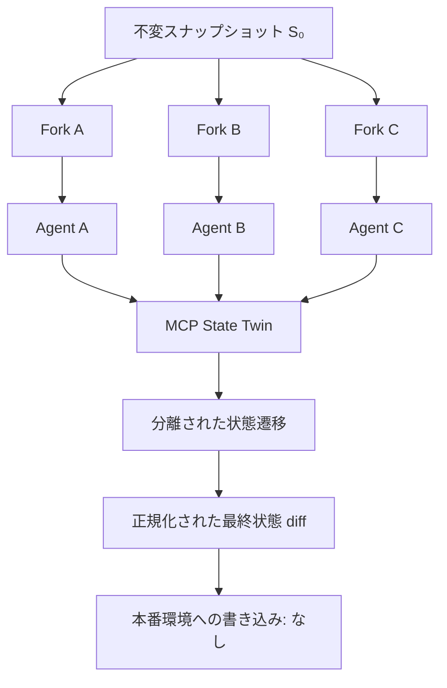

<div align="center">

# 🪞 MCP State Twin

**再現可能な AI Agent 評価のための、決定論的・フォーク可能・ステートフルな MCP テストワールド — 本番環境に副作用を与えずに。**

[简体中文](README.md) · [English](README.en.md) · **日本語** · [한국어](README.ko.md)

[](https://github.com/augety121/MCP-State-Twin/actions/workflows/ci.yml)
[](LICENSE)


> **本番環境ではなく、ツールの世界を fork する。**

</div>

MCP State Twin は、Model Context Protocol（MCP）ツールの背後に**決定論的・fork 可能・stateful**なテストワールドを提供する、Agent 評価向けの実験的オープンソース環境レイヤーです。

同一の不変スナップショットから複数の実行を開始し、それぞれが異なる有効なツール呼び出し経路を取った場合でも、**本番サービスへ書き込むことなく**最終状態を比較できます。



> [!NOTE]
> README の翻訳は説明目的です。技術的な意味、保証範囲、現在主張できる実装状態は RFC、採用済み ADR、仕様書、Implementation Status の証拠、および実行可能なテストによって定義されます。

## ステータス

**Development preview（`0.1.0-dev`）。タグ付きリリースはまだありません。** Go CLI とランタイムは動作しますが、production-ready ではなく、RFC が定める v0.1 release gate をまだ完了していません。

### 実装済み・検証済みの主な機能

- TwinSpec `v1alpha1` YAML の厳格なデコード、構造検証、hermetic JSON Schema 2020-12 入出力コンパイル
- Spec、MCP tool surface、world state の canonical SHA-256 digest
- `current` / `drifted` / `unknown` surface 不一致時に fail closed する upstream binding admission
- 4,096-byte 上限と cost limit を持つ CEL 式（precondition / effect / query / postcondition / global invariant）
- SQLite ベースの atomic transition、versioned database identity、tool-call audit、transactional control-operation audit
- 不変 logical snapshot、分離 fork、reset、canonical state diff
- Official Go SDK を用いた stateless Streamable HTTP MCP data plane
- 独立認証された HTTP control plane
- 合成状態を利用する 6-tool issue-tracker reference twin
- unit / deterministic replay / MCP HTTP / authorization / output rollback / migration refusal / 100-fork isolation test
- Linux CI での固定版 MCP conformance check（initialize、ping、tools-list、JSON Schema 2020-12）
- bounded TwinSpec/CEL fuzz target と secret-policy / loopback-only hermetic CI gate
- initialize → snapshot → fork ×2 → 各 fork を変更 → terminal diff の CLI ループ
- deterministic environment identity、ordered tool trace、JSON Pointer state assertion、canonical state diff を備えた bounded Scenario `v1alpha1` runner

### 未実装または未検証

- recorder、cassette replay、trace redaction、自動 upstream surface inspection/refresh
- deterministic fault injection、virtual-clock advancement
- 実際の ChatGPT / OpenAI API / Claude / Claude Code smoke test
- evidence-derived host compatibility report、provider harness
- differential validation、L2 fidelity promotion workflow
- data-plane authentication、TLS、remote multi-tenancy、security audit

詳細は [Implementation Status](docs/IMPLEMENTATION-STATUS.md) を参照してください。Roadmap 上の項目を現在の機能として表現することはありません。

## なぜ必要なのか

ツールを使用する Agent の本格的な評価には、「もっともらしい JSON」だけでは不十分です。

Issue tracker Agent は、issue を読み、comment を追加し、曖昧な timeout の後に再試行し、再度 issue を読み、期待した状態が存在する場合だけ close するかもしれません。**各呼び出しが、その後の呼び出しで観測されるべき状態を変化させます。**

| アプローチ | 強み | Agent 評価における境界 |
|---|---|---|
| Record/replay | 既に記録した経路を再現 | 新しいモデルが未記録の有効経路を取る可能性がある |
| Static MCP mock | クライアントを分離し、制御された応答を返す | cross-call state、constraint、failure semantics が不十分な場合がある |
| Hand-built benchmark sandbox | curated task collection を評価 | 開発者所有の tool surface の再利用が主目的ではない |
| Live test / production service | 実挙動を確認 | side effect、rate limit、cost、shared-state pollution、再現不能な開始状態 |
| **MCP State Twin** | forkable world state 上で明示的 transition を実行 | fidelity はモデル化・検証済みの範囲に限定 |

Record/replay は L0 fidelity mode として計画されており、競合ではなく補完的な機能です。

## クイックスタート

要件: **Go 1.26.x**、**Git**

```bash
go mod download
go run ./cmd/statetwin validate \
  --spec examples/issue-tracker/twin.yaml
```

隔離 DB と base snapshot を作成します。

```bash
go run ./cmd/statetwin init \
  --spec examples/issue-tracker/twin.yaml \
  --fixture examples/issue-tracker/state.json \
  --db demo.db \
  --branch main \
  --snapshot base
```

同じ snapshot から 2 つの world を fork します。

```bash
go run ./cmd/statetwin fork --db demo.db --snapshot base --branch run-a
go run ./cmd/statetwin fork --db demo.db --snapshot base --branch run-b
```

異なる有効 trajectory を実行します。

```bash
go run ./cmd/statetwin call \
  --spec examples/issue-tracker/twin.yaml \
  --db demo.db \
  --branch run-a \
  --tool create_issue \
  --input '{"owner":"octo","repository":"demo","title":"Fork A","body":"Created only in A"}'

go run ./cmd/statetwin call \
  --spec examples/issue-tracker/twin.yaml \
  --db demo.db \
  --branch run-b \
  --tool close_issue \
  --input '{"owner":"octo","repository":"demo","number":1}'
```

最終状態を比較します。

```bash
go run ./cmd/statetwin diff \
  --db demo.db \
  --before run-a \
  --after run-b
```

Diff は安定した JSON Pointer path を使用します。key に `/` が含まれる場合は JSON Pointer 規則に従って escape され、`octo/demo#1` は `octo~1demo#1` と表示されます。

## 再現可能な Scenario

```bash
go run ./cmd/statetwin scenario \
  --spec examples/issue-tracker/twin.yaml \
  --fixture examples/issue-tracker/state.json \
  --scenario examples/issue-tracker/scenario-close-issue.yaml
```

予期しない error class または assertion failure が発生すると non-zero で終了します。JSON report には environment digest、ordered tool trace、initial/terminal state digest、assertion evidence、canonical state diff が含まれます。

現在の runner identity は `scripted-scenario` であり、実際の Codex / OpenAI / Claude 等の model evaluation としては扱いません。

> [!WARNING]
> Scenario report には tool input と result が含まれます。synthetic fixture のみを使用し、credential、production trace、personal data を含む report を commit しないでください。

## MCP Server の起動

```bash
export STATETWIN_CONTROL_TOKEN='replace-with-a-local-secret'
```

PowerShell:

```powershell
$env:STATETWIN_CONTROL_TOKEN = 'replace-with-a-local-secret'
```

```bash
go run ./cmd/statetwin serve \
  --spec examples/issue-tracker/twin.yaml \
  --fixture examples/issue-tracker/state.json \
  --db demo.db
```

| Plane | Endpoint | 公開される操作 |
|---|---|---|
| Agent data plane | `http://127.0.0.1:8090/mcp/main` | モデル化済み business tool のみ |
| Private control plane | `http://127.0.0.1:8091/v1` | branch state、snapshot、fork、reset、diff |

Branch ID は model-visible な追加引数ではなく MCP URL に含まれます。これにより branch が異なっても tool input schema は同一です。

> [!WARNING]
> 現在の data plane には authentication と TLS がありません。両 server は既定で loopback に bind し、ローカルでのみ利用してください。control token だけでは Internet 公開に安全な構成にはなりません。

## Reference Twin

Agent-visible tool:

- `get_repository`
- `list_issues`
- `get_issue`
- `create_issue`
- `add_comment`
- `close_issue`

Snapshot、fork、reset、diff、state inspection、将来の fault control は MCP tool ではなく `tools/list` に現れません。

Reference twin は synthetic、`L1`、`unverified`、upstream に対して `unbound` です。**GitHub-equivalent environment と表現してはいけません。**

## TwinSpec

TwinSpec は modelled tool world の versioned / reviewable contract です。

```text
tool behavior = input contract
              + reads and preconditions
              + deterministic state effects
              + postconditions and global invariants
              + structured result or typed error
              + time and idempotency semantics
```

完全な実行可能 spec は [examples/issue-tracker/twin.yaml](examples/issue-tracker/twin.yaml) を参照してください。

### Expression boundary

TwinSpec expression は `cel-go` を使用し、source は最大 4,096 UTF-8 byte、load 時に compile、cost limit 10,000 で評価されます。利用可能な JSON-shaped variable は `input`、`state`、`vars`、`item`、`clock`、`call_index` のみです。

filesystem、process、network、reflection、任意の Go function は登録されません。`v1alpha1` は native extension をサポートしません。

### JSON Schema boundary

Tool input と successful output は JSON Schema Draft 2020-12 として compile / validate されます。format assertion は有効です。local `$defs` / fragment は利用できますが、外部 network / filesystem resource を必要とする reference は startup 時に失敗します。宣言済み output が無効な場合、transition は rollback され `INTERNAL_TWIN_ERROR` を返します。

### Effect operation

| Operation | Semantics |
|---|---|
| `allocate` | deterministic sequence を increment し `vars` に bind |
| `insert` | keyed entity を insert。既存なら conflict |
| `update` | keyed entity を replace または merge。存在しなければ fail |
| `delete` | keyed entity を delete。存在しなければ fail |

## Determinism contract

**決定論的なのは environment であり、language model ではありません。**

```text
E = (runtime version,
     TwinSpec digest,
     snapshot digest,
     scenario seed,
     ordered tool calls)

execute(E) -> (ordered structured results, final state digest)
```

各 comparison run は同じ immutable snapshot から開始し、成功判定は exact trajectory equality ではなく terminal state と declared invariant に基づきます。

## Error / transaction semantics

```text
load branch head
  -> validate input
  -> evaluate preconditions
  -> apply effects to an isolated working state
  -> evaluate query, postconditions, and global invariants
  -> commit state and audit record atomically
```

Canonical error class:

- `INVALID_INPUT`
- `PRECONDITION_FAILED`
- `NOT_FOUND`
- `CONFLICT`
- `INVARIANT_VIOLATION`
- `UNMODELED_BEHAVIOR`
- `INTERNAL_TWIN_ERROR`

Timeout-before-effect、timeout-after-effect、partial-effect、rate-limit、eventual-consistency fault は仕様化されていますが、まだ実装されていません。

## Fidelity level

| Level | 意味 | 想定用途 |
|---|---|---|
| L0 — Cassette replay | 記録済み interaction に一致 | exact-path smoke/regression test |
| L1 — Stateful template | explicit entity と reviewed basic transition | development / exploratory workflow test |
| L2 — Contract-backed | reviewed rule / invariant / differential test / upstream fingerprint | 宣言済み範囲での CI / evaluation |
| L3 — Native/reference | shared または domain-provided reference logic | high-fidelity domain simulation |

生成・推論された behavior が自動的に L2/L3 へ昇格することはありません。現在の reference twin は **L1 / unverified** です。

## MCP と model provider

Core は model-provider SDK ではなく MCP と統合します。同じ tool surface を提供できても、異なる model が同じ tool や trajectory を選ぶとは主張しません。

Official Go SDK を server / client の両方で用いた stateless Streamable HTTP integration test があり、Linux CI では MCP conformance framework `v0.1.16` を固定して initialize、ping、tools-list、JSON Schema 2020-12 を検証します。

Repository はまだ live ChatGPT / OpenAI / Claude smoke test を完了していません。

Design sources:

- [MCP Specification 2026-07-28](https://modelcontextprotocol.io/specification/2026-07-28)
- [Official MCP Go SDK](https://github.com/modelcontextprotocol/go-sdk)
- [OpenAI: ChatGPT Developer mode](https://developers.openai.com/api/docs/guides/developer-mode)
- [OpenAI: MCP servers for plugins and API integrations](https://developers.openai.com/api/docs/mcp)
- [Anthropic: MCP connector](https://platform.claude.com/docs/en/agents-and-tools/mcp-connector)

## CLI

```text
statetwin validate   validate structure, CEL, and print the spec digest
statetwin init       initialize a branch and optional immutable snapshot
statetwin call       execute one tool directly against a branch
statetwin state      inspect canonical branch state
statetwin snapshot   create an immutable logical snapshot
statetwin fork       create an isolated branch from a snapshot
statetwin diff       compare two branch states
statetwin scenario   execute a bounded scripted scenario and assertions
statetwin serve      run separate MCP data and HTTP control planes
statetwin version    print the development version
```

## Test / Build

```bash
gofmt -w .
go vet ./...
go test ./...
go test -race ./...
go build ./cmd/statetwin
```

## Trust boundary

### Agent data plane

- TwinSpec に定義された business tool のみ公開
- URL で branch を bind
- hidden expected state や test control を公開しない
- typed domain failure を model-observable MCP tool error として返す

### Simulation control plane

- 独立 bearer token が必要
- state / snapshot / fork / reset / diff を提供
- data plane とは異なる loopback address/port に既定で bind
- Agent ではなく test harness または human が操作

**Prompt instruction は authorization boundary ではありません。**

## ドキュメント

- [Implementation Status](docs/IMPLEMENTATION-STATUS.md)
- [RFC-0001](docs/RFC-0001.md)
- [RFC-0002](docs/RFC-0002-V0.1-RELEASE-PROFILE.md)
- [SPEC-0001](docs/SPEC-0001-TWINSPEC-CORE.md) / [SPEC-0002](docs/SPEC-0002-RUNTIME-SEMANTICS.md) / [SPEC-0003](docs/SPEC-0003-MCP-BOUNDARIES-AND-COMPATIBILITY.md)
- [SPEC-0004](docs/SPEC-0004-EVIDENCE-FIDELITY-AND-RELEASE.md) / [SPEC-0005](docs/SPEC-0005-SCENARIO-AND-REPORT.md) / [SPEC-0006](docs/SPEC-0006-HOST-COMPATIBILITY-AND-MODEL-EVALUATION.md)
- [Failure Mode Matrix](docs/FAILURE-MODE-MATRIX.md)
- [v0.1 P0 Traceability](docs/V0.1-P0-TRACEABILITY.md)
- [Competitive Landscape](docs/COMPETITIVE-LANDSCAPE.md)
- [Roadmap](docs/ROADMAP.md)

RFC と accepted ADR は intended semantics を定義し、Implementation Status と executable test は現在の build が実際に主張できる内容を定義します。

## Contributing / Security

Protocol、TwinSpec、canonicalization、trust-boundary semantics を変更する前に [CONTRIBUTING.md](CONTRIBUTING.md) を読んでください。

Synthetic local fixture 以外のデータを利用する前に [SECURITY.md](SECURITY.md) を確認してください。credential、production trace、personal data、再配布権限のない third-party recording を commit しないでください。

## Positioning

この project は「最初の mock server / stateful sandbox / service virtualization system / digital twin」であるとは主張しません。

仮説はより限定的です。Agent engineering には、MCP-compatible surface、explicit state-transition contract、forkable deterministic world state、strict control-plane isolation、declared fidelity と differential validation を再利用可能な形で組み合わせる価値がある、というものです。

Prior-art 調査は [Competitive Landscape](docs/COMPETITIVE-LANDSCAPE.md) にあります。より強い prior art が見つかった場合、positioning は証拠に応じて更新されるべきです。

## License

[MIT](LICENSE)
