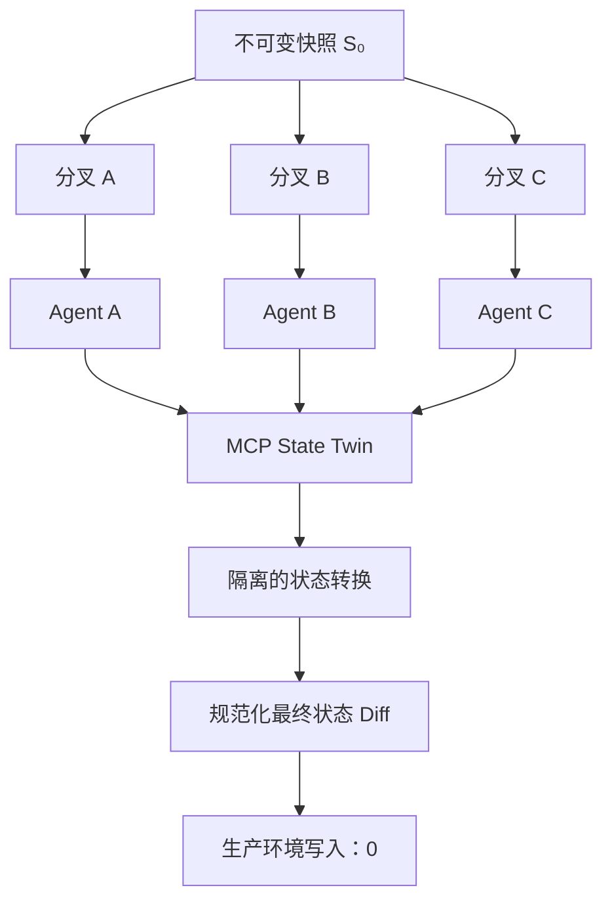

<div align="center">

# 🪞 MCP State Twin

**用于可复现 AI Agent 评测的确定性、可分叉、有状态 MCP 测试世界——不对生产环境产生副作用。**

**简体中文** · [English](README.en.md) · [日本語](README.ja.md) · [한국어](README.ko.md)

[](https://github.com/augety121/MCP-State-Twin/actions/workflows/ci.yml)
[](LICENSE)


> **分叉工具世界，而不是生产环境。**

</div>

MCP State Twin 是一个面向 Agent 评测的实验性开源环境层：它在 Model Context Protocol（MCP）工具背后提供**确定性、可分叉、有状态**的测试世界。

它允许 Agent 工程师从同一个不可变世界快照启动多次运行，让每次运行采取不同但合法的工具调用轨迹，并在**不写入生产服务**的前提下比较最终状态。



> [!NOTE]
> README 的多语言版本用于帮助阅读，不重新定义项目语义。项目的技术语义与当前可声明能力边界，以 RFC、已接受 ADR、规范文档、Implementation Status 证据和可执行测试为准。

## 项目状态

**开发预览版（`0.1.0-dev`），当前没有已打标签的正式 Release。** 仓库已经包含可工作的 Go CLI 与运行时，但仍未达到 production-ready，也尚未完成 RFC 中 v0.1 的全部发布门槛。

### 已实现并经过本地/CI 覆盖的能力

- 严格的 TwinSpec `v1alpha1` YAML 解码与结构校验，以及 hermetic JSON Schema 2020-12 输入/输出编译；
- 对 Spec、MCP 工具表面和世界状态生成规范化 SHA-256 摘要；
- 上游绑定准入检查：当 `current`、`drifted` 或 `unknown` 工具表面不匹配时 fail closed；
- 最大 4,096 字节、带执行成本限制的 CEL 表达式，用于前置条件、effects、查询、后置条件和全局不变量；
- 基于 SQLite 的原子状态转换、版本化数据库身份、工具调用审计，以及事务化控制操作审计；
- 不可变逻辑快照、隔离分叉、reset 和规范化状态 diff；
- 基于官方 Go SDK 的无状态 Streamable HTTP MCP 数据面；
- 独立鉴权的 HTTP 控制面；
- 一个包含 6 个工具、使用合成状态的 issue-tracker 参考 Twin；
- 单元测试、确定性重放测试、MCP HTTP 测试、鉴权测试、输出回滚测试、迁移拒绝测试，以及 100 分叉隔离测试；
- Linux CI 中固定版本的官方 MCP conformance 检查，覆盖 initialize、ping、tools-list 和 JSON Schema 2020-12；
- 有界 TwinSpec/CEL fuzz 目标，以及固定的 secret-policy 与仅 loopback 的 hermetic CI gate；
- 已测试的 CLI 主链路：initialize → snapshot → fork 两次 → 分别修改 → diff 最终状态；
- 有界 Scenario `v1alpha1` runner，提供确定性的环境身份、按序工具 trace、JSON Pointer 状态断言和规范化状态 diff。

### 尚未实现或尚未验证

- recorder、cassette replay、trace 脱敏，或自动上游工具表面检查/刷新；
- 确定性故障注入或虚拟时钟推进；
- 真实 ChatGPT、OpenAI API、Claude 或 Claude Code smoke test；
- 基于证据的 host 兼容性报告或 provider harness；
- differential validation 或 L2 fidelity 晋级工作流；
- 数据面鉴权、TLS、远程多租户或正式安全审计。

详见 [Implementation Status](docs/IMPLEMENTATION-STATUS.md)。路线图中的能力不会被描述成当前已实现功能。

协议兼容性和模型兼容性是两个不同的问题。运行时可以暴露 provider-neutral 的 MCP 工具表面，但 ChatGPT、OpenAI API 客户端、Claude、Claude Code 以及自定义 Agent 可能选择完全不同的工具调用轨迹。只有在版本化 smoke run 产出 [SPEC-0006](docs/SPEC-0006-HOST-COMPATIBILITY-AND-MODEL-EVALUATION.md) 要求的证据后，某个 host 才会被列为已验证。

## 为什么要做这个项目

严肃的工具型 Agent 测试，仅靠“看起来合理的 JSON”是不够的。

例如，一个 issue-tracker Agent 可能先读取 issue、创建评论、在模糊超时后重试、再次读取 issue，并且只有在预期状态真实存在时才关闭它。**每一次调用都会改变后续调用应该看到的世界。**

常见方案解决的是相关但不同的问题：

| 方案 | 主要优势 | 用于 Agent 评测时的边界 |
|---|---|---|
| Record/replay | 重现之前捕获过的调用路径 | 新模型可能采取从未被录制过、但仍然合法的路径 |
| 静态 MCP mock | 隔离客户端并返回可控数据 | 跨调用状态、约束和失败语义可能不完整 |
| 手工 benchmark sandbox | 评估一组精心设计的任务 | 复用开发者自有工具表面并不是其核心抽象 |
| Live 测试/生产服务 | 运行真实行为 | 有副作用、限流、成本、共享状态污染，而且起点难以复现 |
| **MCP State Twin** | 在可分叉世界状态上执行显式状态转换 | fidelity 只覆盖已经建模并验证的行为 |

Record/replay 计划作为 L0 fidelity 模式存在；它与 MCP State Twin 是互补关系，而不是要被取代的方案。

## 快速开始

### 环境要求

- Go 1.26.x
- Git

克隆仓库后，先校验参考 TwinSpec：

```bash
go mod download
go run ./cmd/statetwin validate \
  --spec examples/issue-tracker/twin.yaml
```

创建隔离数据库和基础快照：

```bash
go run ./cmd/statetwin init \
  --spec examples/issue-tracker/twin.yaml \
  --fixture examples/issue-tracker/state.json \
  --db demo.db \
  --branch main \
  --snapshot base
```

从同一个世界快照分叉两次：

```bash
go run ./cmd/statetwin fork --db demo.db --snapshot base --branch run-a
go run ./cmd/statetwin fork --db demo.db --snapshot base --branch run-b
```

让两个分叉采取不同但合法的轨迹：

```bash
go run ./cmd/statetwin call \
  --spec examples/issue-tracker/twin.yaml \
  --db demo.db \
  --branch run-a \
  --tool create_issue \
  --input '{"owner":"octo","repository":"demo","title":"Fork A","body":"Created only in A"}'

go run ./cmd/statetwin call \
  --spec examples/issue-tracker/twin.yaml \
  --db demo.db \
  --branch run-b \
  --tool close_issue \
  --input '{"owner":"octo","repository":"demo","number":1}'
```

比较两个最终世界：

```bash
go run ./cmd/statetwin diff \
  --db demo.db \
  --before run-a \
  --after run-b
```

Diff 使用稳定的 JSON Pointer 路径。对象 key 中的 `/` 会按 JSON Pointer 规则转义，例如 `octo/demo#1` 会显示为 `octo~1demo#1`。

## 运行可复现场景

执行仓库自带的、按状态评分的 Scenario：

```bash
go run ./cmd/statetwin scenario \
  --spec examples/issue-tracker/twin.yaml \
  --fixture examples/issue-tracker/state.json \
  --scenario examples/issue-tracker/scenario-close-issue.yaml
```

如果出现非预期错误类别或断言失败，命令会以非 0 状态退出。JSON 报告包含：环境摘要、按序工具 trace、初始/最终状态摘要、断言证据和规范化状态 diff。

当前 runner 的身份是 `scripted-scenario`。它**不会**被描述成真实 Codex、OpenAI、Claude 或其他模型评测。

> [!WARNING]
> Scenario 报告会包含工具输入与结果。请只使用合成 fixture；不要提交含凭证、生产 trace 或个人数据的报告。

## 运行 MCP Server

先设置控制面 token，请勿提交到仓库：

```bash
export STATETWIN_CONTROL_TOKEN='replace-with-a-local-secret'
```

PowerShell：

```powershell
$env:STATETWIN_CONTROL_TOKEN = 'replace-with-a-local-secret'
```

启动运行时：

```bash
go run ./cmd/statetwin serve \
  --spec examples/issue-tracker/twin.yaml \
  --fixture examples/issue-tracker/state.json \
  --db demo.db
```

默认 endpoint：

| 平面 | Endpoint | 可见操作 |
|---|---|---|
| Agent 数据面 | `http://127.0.0.1:8090/mcp/main` | 仅暴露已建模业务工具 |
| 私有控制面 | `http://127.0.0.1:8091/v1` | branch state、snapshot、fork、reset、diff |

Branch ID 是 MCP URL 的一部分，而不是额外暴露给模型的工具参数，因此不同分支可以保持完全相同的工具输入 schema。

> [!WARNING]
> 当前数据面没有鉴权或 TLS。两个服务默认只绑定 loopback，并应保持本地使用。控制面 token 只是开发期的一层保护，**不能**让当前构建版本适合直接暴露到公网。

## 参考 Twin

仓库自带的 issue-tracker 世界向 Agent 暴露 6 个工具：

- `get_repository`
- `list_issues`
- `get_issue`
- `create_issue`
- `add_comment`
- `close_issue`

Snapshot、fork、reset、diff、状态检查以及未来的 fault control **都不是 MCP 工具**，不会出现在 `tools/list` 中。集成测试通过官方 MCP Go client 验证这一边界。

该参考 Twin 使用合成数据，fidelity 为 `L1`，状态为 `unverified`，并且 `unbound` 于任何上游服务。**它不能被描述为 GitHub 等价环境。**

## TwinSpec

TwinSpec 是对“已建模工具世界”进行版本化、可审查描述的契约。一个工具远不止 `function(args) -> JSON`：

```text
tool behavior = input contract
              + reads and preconditions
              + deterministic state effects
              + postconditions and global invariants
              + structured result or typed error
              + time and idempotency semantics
```

可执行参考 Spec 片段：

```yaml
apiVersion: statetwin.dev/v1alpha1
kind: Twin

metadata:
  name: issue-tracker
  upstream:
    protocol: mcp
    status: unbound
  fidelity:
    level: L1
    status: unverified

clock:
  mode: virtual
  initial: "2026-08-01T00:00:00Z"

state:
  entities:
    repository:
      key: [owner, name]
    issue:
      key: [repository, number]

tools:
  - name: close_issue
    description: Close an existing open issue in the isolated simulated repository.
    preconditions:
      - expr: "state.entities.issue[input.owner + '/' + input.repository + '#' + string(input.number)].state == 'open'"
        code: CONFLICT
        message: issue is already closed
    effects:
      - op: update
        entity: issue
        key: "input.owner + '/' + input.repository + '#' + string(input.number)"
        merge: true
        value: "{'state': 'closed', 'closedAt': clock}"
```

完整文件见 [examples/issue-tracker/twin.yaml](examples/issue-tracker/twin.yaml)。

### 表达式边界

TwinSpec 表达式使用 `cel-go`。源码长度限制为 4,096 UTF-8 字节，在加载阶段编译，并以 10,000 的 cost limit 执行。表达式只能访问 JSON 形态的变量：

- `input`
- `state`
- `vars`
- `item`
- `clock`
- `call_index`

不会注册文件系统、进程、网络、反射或任意 Go 函数；`v1alpha1` 不支持 native extension。

### JSON Schema 边界

工具输入和成功输出都会按 JSON Schema Draft 2020-12 编译和校验，并启用 format assertion。支持本地 `$defs` 与 fragment；如果 `$ref` 需要访问外部网络或文件系统资源，运行时会在启动阶段失败。

如果声明的成功输出不符合 schema，该状态转换会回滚，并返回 `INTERNAL_TWIN_ERROR`。

### 当前 effect 操作

| 操作 | 语义 |
|---|---|
| `allocate` | 对命名确定性 sequence 自增，并把结果绑定到 `vars` |
| `insert` | 插入一个带 key 的实体；已存在时冲突 |
| `update` | 替换或 merge 一个带 key 的实体；不存在时失败 |
| `delete` | 删除一个带 key 的实体；不存在时失败 |

## 确定性契约

**确定的是环境，不是语言模型。**

```text
E = (runtime version,
     TwinSpec digest,
     snapshot digest,
     scenario seed,
     ordered tool calls)

execute(E) -> (ordered structured results, final state digest)
```

当前实现会虚拟化状态分配，以及表达式可见的时间。测试会在两个 branch 上重放 1,000 次调用语料，并在每次状态转换后与最终状态上检查一致性。

模型仍然可以选择不同的调用序列，这是预期行为。比较运行从同一个不可变快照出发，成功与否根据最终状态和声明的不变量判断，而不是强制要求调用轨迹逐步完全一致。

## 错误与事务语义

普通工具状态转换在一个 SQLite 事务中完成：

```text
load branch head
  -> validate input
  -> evaluate preconditions
  -> apply effects to an isolated working state
  -> evaluate query, postconditions, and global invariants
  -> commit state and audit record atomically
```

Domain failure 会保留之前的 state digest，同时仍追加一条工具调用审计记录。当前规范化错误类别包括：

- `INVALID_INPUT`
- `PRECONDITION_FAILED`
- `NOT_FOUND`
- `CONFLICT`
- `INVARIANT_VIOLATION`
- `UNMODELED_BEHAVIOR`
- `INTERNAL_TWIN_ERROR`

以下 fault 目前仍处于已规范但未实现状态：timeout-before-effect、timeout-after-effect、partial-effect、rate-limit、eventual-consistency。

SQLite 文件带有 State Twin application ID 和显式 schema version。Snapshot 会持久化该存储 schema version，并将其绑定进 snapshot ID。非本项目数据库，以及版本高于当前运行时的数据库都会被拒绝。

Snapshot、fork 和 reset 会在特权状态修改所在的同一事务里写入独立 control-audit 行；bearer token 和 HTTP header 不会被记录。

## Fidelity 等级

“Twin”并不意味着“完美副本”。Fidelity 必须被明确声明、限制在可证明范围内，并由证据支持。

| 等级 | 含义 | 预期用途 |
|---|---|---|
| L0 — Cassette replay | 匹配已录制交互 | 精确路径 smoke/regression test |
| L1 — Stateful template | 显式实体 + 经审查的基础状态转换 | 开发与探索性 workflow test |
| L2 — Contract-backed | 人工审查规则、不变量、differential test、上游 fingerprint | 在已声明覆盖范围内做 CI/评测 |
| L3 — Native/reference | 共享或领域提供的参考逻辑 | 高保真领域模拟 |

自动生成或推断出的行为不能自行把 fidelity 提升到 L2/L3。当前参考 Twin 是 **L1 + unverified**。

## MCP 与模型提供方

核心项目集成的是 MCP，而不是某个模型厂商的 SDK。这是有意设计：项目可以提供统一的工具表面，但不会声称不同模型会选择相同工具或遵循相同轨迹。

自动化集成测试使用官方 Go SDK 作为 server 与 client，并通过 stateless Streamable HTTP 通信。Linux CI 还会运行固定版本的官方 MCP conformance framework `v0.1.16`，覆盖 initialize、ping、tools-list 和 JSON Schema 2020-12。

该 conformance framework 当前覆盖到 `2025-11-25` 协议版本；这**不等于**证明设计基线 `2026-07-28` 的每个特性都已经通过验证。

OpenAI 已公开 remote MCP server 与 ChatGPT Developer mode 的读写工具能力；Anthropic 也公开了 remote MCP tool call，并且其 Messages API connector 当前只支持 tool-call 子集。这些外部能力推动了本项目的 tools-first 设计，但**本仓库尚未完成真实 provider smoke test**。

设计来源：

- [MCP Specification 2026-07-28](https://modelcontextprotocol.io/specification/2026-07-28)
- [Official MCP Go SDK](https://github.com/modelcontextprotocol/go-sdk)
- [OpenAI: ChatGPT Developer mode](https://developers.openai.com/api/docs/guides/developer-mode)
- [OpenAI: MCP servers for plugins and API integrations](https://developers.openai.com/api/docs/mcp)
- [Anthropic: MCP connector](https://platform.claude.com/docs/en/agents-and-tools/mcp-connector)

## CLI

```text
statetwin validate   validate structure, CEL, and print the spec digest
statetwin init       initialize a branch and optional immutable snapshot
statetwin call       execute one tool directly against a branch
statetwin state      inspect canonical branch state
statetwin snapshot   create an immutable logical snapshot
statetwin fork       create an isolated branch from a snapshot
statetwin diff       compare two branch states
statetwin serve      run separate MCP data and HTTP control planes
statetwin version    print the development version
```

除 server log 与 fatal diagnostic 外，CLI 输出均为结构化 JSON。

## 测试与构建

```bash
gofmt -w .
go vet ./...
go test ./...
go test -race ./...
go build ./cmd/statetwin
```

当前 README 基线记录的最近本地验证环境为 Windows amd64 + Go 1.26.5。GitHub Actions 在 Linux 上执行 formatting、vet、race-enabled test、coverage collection 和 build。

## 架构与信任边界

项目明确拆分两个 trust domain：

### Agent 数据面

- 只暴露 TwinSpec 声明的业务工具；
- 通过 URL 绑定 branch；
- 永远不向 Agent 广播隐藏的 expected state 或测试控制能力；
- 将 typed domain failure 作为 Agent 可观察的 MCP tool error 返回。

### Simulation 控制面

- 使用独立 bearer token；
- 支持 branch state、snapshot、fork、reset 和 diff；
- 默认绑定到另一组 loopback 地址/端口；
- 由 test harness 或人操作，而不是由被测 Agent 控制。

**Prompt instruction 不是授权边界。**

## 文档

| 文档 | 作用 |
|---|---|
| [Implementation Status](docs/IMPLEMENTATION-STATUS.md) | 基于证据的 implemented / partial / missing 矩阵 |
| [RFC-0001](docs/RFC-0001.md) | 产品边界、硬不变量、架构、语义和 release gate |
| [RFC-0002](docs/RFC-0002-V0.1-RELEASE-PROFILE.md) | 首个 release 的规范化 profile、限制、traceability 和 gate |
| [SPEC-0001](docs/SPEC-0001-TWINSPEC-CORE.md) | TwinSpec v1alpha1 数据模型与 admission rule |
| [SPEC-0002](docs/SPEC-0002-RUNTIME-SEMANTICS.md) | 确定性、事务、snapshot、错误与限制 |
| [SPEC-0003](docs/SPEC-0003-MCP-BOUNDARIES-AND-COMPATIBILITY.md) | MCP 数据/控制面、hermetic mode 与 provider neutrality |
| [SPEC-0004](docs/SPEC-0004-EVIDENCE-FIDELITY-AND-RELEASE.md) | 证据、provenance、fidelity 与 release gate |
| [SPEC-0005](docs/SPEC-0005-SCENARIO-AND-REPORT.md) | 有界 Scenario、状态断言、环境身份与证据报告 |
| [SPEC-0006](docs/SPEC-0006-HOST-COMPATIBILITY-AND-MODEL-EVALUATION.md) | Host profile、模型评测隔离、兼容性证据与声明语言 |
| [ADR-0001](docs/ADR-0001-PROTOCOL-BASELINE.md) | MCP 协议基线与 provider neutrality |
| [ADR-0002](docs/ADR-0002-CONTROL-PLANE-ISOLATION.md) | 数据面 / 控制面隔离 |
| [ADR-0003](docs/ADR-0003-EXPRESSION-ENGINE.md) | 有界 CEL 表达式 |
| [ADR-0004](docs/ADR-0004-STORAGE-AND-SNAPSHOTS.md) | SQLite 与逻辑 snapshot 策略 |
| [ADR-0005](docs/ADR-0005-CANONICAL-JSON.md) | Alpha canonical digest contract |
| [ADR-0006](docs/ADR-0006-JSON-SCHEMA-VALIDATION.md) | Hermetic JSON Schema 2020-12 校验 |
| [ADR-0007](docs/ADR-0007-STORAGE-IDENTITY-AND-CONTROL-AUDIT.md) | SQLite identity/version 与特权操作审计 |
| [ADR-0008](docs/ADR-0008-MCP-TOOL-SURFACE-DIGEST.md) | 规范化 model-facing MCP surface 与 fail-closed binding |
| [ADR-0009](docs/ADR-0009-OPERATIONAL-LOGGING-BOUNDARY.md) | Operational log 脱敏边界 |
| [ADR-0010](docs/ADR-0010-SCENARIO-ARTIFACTS.md) | 有界 Scenario artifact 与 scripted evidence report |
| [Failure Mode Matrix](docs/FAILURE-MODE-MATRIX.md) | 设计风险和必需响应；不是测试完成报告 |
| [v0.1 P0 Traceability](docs/V0.1-P0-TRACEABILITY.md) | P0 逐项证据、排除项和稳定发布 blocker |
| [Competitive Landscape](docs/COMPETITIVE-LANDSCAPE.md) | 带日期的 prior-art 调研与被拒方案 |
| [Roadmap](docs/ROADMAP.md) | 有序阶段与退出标准 |

RFC 和已接受 ADR 定义设计意图；Implementation Status 与可执行测试定义当前开发构建**实际上可以诚实声明什么**。

## 首个正式 Release 路线图

当前 release-critical 工作包括：

1. 虚拟时间推进与确定性的计划故障；
2. crash kill-point 与 tagged-database migration fixture；
3. 上游 surface inspector 与自动刷新（规范化本地 binding 已实现）；
4. 在 Linux CI 上证明新的 egress-deny hermetic integration gate；
5. 固定版本的官方 MCP conformance scenario，覆盖 tools-first 子集；
6. 真实 OpenAI/ChatGPT 与 Anthropic/Claude smoke-test 矩阵；
7. 如果 recorder 进入 v0.1 scope，则补齐 recorder redaction test；仓库 secret scanning 独立配置；
8. differential validation 与诚实的 L2 coverage report；
9. 第二个独立、有状态的参考领域；
10. 完成 P0/P1 failure-mode traceability。

Cloud hosting、registry、marketplace 和自动生产镜像不是首个正式 Release 的优先事项。

## 贡献与安全

在修改 protocol、TwinSpec、canonicalization 或 trust-boundary 语义前，请先阅读 [CONTRIBUTING.md](CONTRIBUTING.md)。

在使用合成本地 fixture 以外的任何数据前，请阅读 [SECURITY.md](SECURITY.md)。不要提交凭证、生产 trace、个人数据，或你无权重新分发的第三方录制内容。

## 项目定位与研究声明

本项目**不声称**自己是第一个 mock server、stateful sandbox、service virtualization 系统或 digital twin。

它提出的更窄假设是：Agent 工程需要一种可复用组合，将以下能力放在一起：

- MCP-compatible 的 Agent-facing surface；
- 显式状态转换契约；
- 可分叉的确定性世界状态；
- 严格控制面隔离；
- 明确声明的 fidelity 与 differential validation。

Prior-art 调研记录在 [Competitive Landscape](docs/COMPETITIVE-LANDSCAPE.md)。一次带日期的公开检索无法证明不存在类似的公开、私有或未被索引项目。如果出现更强的 prior art，本项目的定位应随证据调整。

## License

[MIT](LICENSE)
