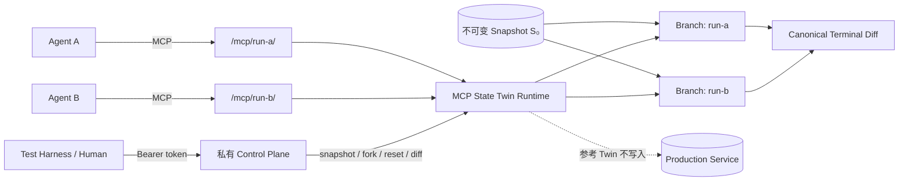

<div align="center">

<h1>MCP State Twin</h1>

<p><strong>用于可复现 AI Agent 评测的确定性、可分叉、有状态 MCP 测试世界</strong></p>
<p>从同一世界快照出发，让不同 Agent 安全地执行不同工具轨迹，再比较最终状态——不写入生产服务。</p>

<p>
  <strong>简体中文</strong> ·
  <a href="README.en.md">English</a> ·
  <a href="README.ja.md">日本語</a> ·
  <a href="README.ko.md">한국어</a>
</p>

<p>
  <a href="https://github.com/augety121/MCP-State-Twin/actions/workflows/ci.yml"></a>
  <a href="LICENSE"></a>
  
  
  
</p>

<p><strong>Fork the tool world, not production.</strong></p>
<p><code>snapshot</code> → <code>fork</code> → <code>act</code> → <code>assert</code> → <code>diff</code></p>

</div>

> [!IMPORTANT]
> **Development Preview · `0.1.0-dev` · 无正式 tagged release · 非 production-ready。**
> 当前实现究竟可以声明什么，以 [Implementation Status](docs/IMPLEMENTATION-STATUS.md)、RFC、已接受 ADR、规范文档和可执行测试证据为准。Roadmap 中的能力不会被当作当前功能宣传。

<p align="center">
  <a href="#快速开始"><strong>快速开始</strong></a> ·
  <a href="#30-秒看懂工作原理">工作原理</a> ·
  <a href="#当前状态">当前状态</a> ·
  <a href="#twinspec">TwinSpec</a> ·
  <a href="#架构与安全边界">安全边界</a> ·
  <a href="#文档地图">文档地图</a>
</p>

<table>
<tr>
<td width="25%" align="center"><strong>Reproducible</strong><br><sub>从同一不可变 Snapshot 起步</sub></td>
<td width="25%" align="center"><strong>Forkable</strong><br><sub>每次评测拥有隔离 Branch</sub></td>
<td width="25%" align="center"><strong>Stateful</strong><br><sub>跨工具调用保留真实状态演化</sub></td>
<td width="25%" align="center"><strong>Comparable</strong><br><sub>用 Assertion 与 Canonical Diff 比较终态</sub></td>
</tr>
</table>

## MCP State Twin 是什么？

MCP State Twin 是一个面向 AI Agent 评测的实验性开源环境层。它在 Model Context Protocol（MCP）工具背后提供**确定性、可分叉、有状态**的测试世界，让多个评测运行从同一个不可变快照出发，各自执行不同但合法的工具调用轨迹，并在最后比较世界状态。

核心目标不是让模型“变得确定”，而是让**模型所操作的外部世界可以被复现、隔离、分叉和比较**。

| 维度 | MCP State Twin 的做法 |
|---|---|
| 起点可复现 | 多次运行从同一个不可变 snapshot 开始 |
| 状态隔离 | 每个 fork 拥有独立的状态演化 |
| 工具接口 | 向 Agent 暴露 provider-neutral 的 MCP tool surface |
| 评测方式 | 比较 terminal state、声明的不变量与 canonical diff，而非强制轨迹完全一致 |
| 环境确定性 | 固定环境身份 + 有序工具调用得到可重放的结构化结果与最终状态摘要 |
| 生产副作用 | 参考 Twin 在隔离模拟状态上执行，不写入生产服务 |
| 当前参考 Fidelity | `L1` · `unverified` · `unbound` |
| 当前存储 | SQLite + 版本化数据库身份 + 事务化状态转换 |

### 它不是什么

MCP State Twin **不是**：

- AGI 系统或模型运行时；
- Agent framework、planner 或 orchestration framework；
- memory system 或 RAG service；
- 对真实上游服务的“完美复制”；
- 对 ChatGPT、OpenAI API、Claude、Claude Code 或其他 host 兼容性的自动保证；
- 可以直接暴露到公网的 production service。

“Twin”表示**明确声明、可审查、由证据约束的行为模型**，而不是无限制地声称与真实服务完全等价。

---

## 快速开始

### 环境要求

- Go 1.26.x
- Git

### 1. 获取代码并验证 TwinSpec

```bash
git clone https://github.com/augety121/MCP-State-Twin.git
cd MCP-State-Twin

go mod download

go run ./cmd/statetwin validate \
  --spec examples/issue-tracker/twin.yaml
```

### 2. 初始化世界并创建基础 Snapshot

```bash
go run ./cmd/statetwin init \
  --spec examples/issue-tracker/twin.yaml \
  --fixture examples/issue-tracker/state.json \
  --db demo.db \
  --branch main \
  --snapshot base
```

### 3. 从同一个 Snapshot 创建两个隔离 Fork

```bash
go run ./cmd/statetwin fork --db demo.db --snapshot base --branch run-a
go run ./cmd/statetwin fork --db demo.db --snapshot base --branch run-b
```

### 4. 让两个 Fork 走不同的合法轨迹

```bash
go run ./cmd/statetwin call \
  --spec examples/issue-tracker/twin.yaml \
  --db demo.db \
  --branch run-a \
  --tool create_issue \
  --input '{"owner":"octo","repository":"demo","title":"Fork A","body":"Created only in A"}'

go run ./cmd/statetwin call \
  --spec examples/issue-tracker/twin.yaml \
  --db demo.db \
  --branch run-b \
  --tool close_issue \
  --input '{"owner":"octo","repository":"demo","number":1}'
```

### 5. 比较最终世界

```bash
go run ./cmd/statetwin diff \
  --db demo.db \
  --before run-a \
  --after run-b
```

Diff 使用稳定的 JSON Pointer path。对象 key 中的 `/` 会按 JSON Pointer 规则转义，例如 `octo/demo#1` 会显示为 `octo~1demo#1`。

### 这段 Demo 在验证什么？

它不是在验证两个 Agent 必须走同一条路径，而是在验证：

- 两个运行拥有相同起点；
- 两个 branch 的状态修改彼此隔离；
- 工具调用产生真实的跨调用状态变化；
- 最终世界可以通过 canonical diff 稳定比较。

---

## 30 秒看懂工作原理



一次典型评测可以理解为：

1. 从固定 fixture 初始化一个世界；
2. 创建不可变 snapshot；
3. 从同一 snapshot fork 出多个隔离 branch；
4. 不同 Agent / prompt / model 在各自 branch 上调用同一组 MCP 工具；
5. 根据 terminal state、state assertion、invariant 与 canonical diff 评分；
6. 不要求不同运行采取完全相同的工具调用路径。

> [!NOTE]
> **确定的是环境，不是语言模型。** 模型可以做出不同决策；MCP State Twin 的目标是让这些不同决策发生在可复现、可比较的世界里。

---

## 为什么需要它？

严肃的工具型 Agent 评测，仅靠“看起来合理的 JSON”通常不够。

例如，一个 issue-tracker Agent 可能先读取 issue、添加 comment、在模糊 timeout 后重试、再次读取 issue，然后只有在预期状态存在时才关闭它。**每一次调用都会改变后续调用应该看到的世界。**

常见方案解决的是相关但不同的问题：

| 方案 | 主要优势 | 用于 Agent 评测时的边界 |
|---|---|---|
| Record/replay | 重现已经捕获的调用路径 | 新模型可能采取从未录制过、但仍然合法的路径 |
| 静态 MCP mock | 隔离客户端并返回可控数据 | 跨调用状态、约束、幂等和失败语义可能不完整 |
| 手工 benchmark sandbox | 评估一组精心设计的任务 | 复用开发者自有 tool surface 并不是其核心抽象 |
| Live 测试/生产服务 | 运行真实行为 | 存在副作用、限流、成本、共享状态污染与不可复现起点 |
| **MCP State Twin** | 在可分叉世界状态上执行显式状态转换 | Fidelity 只覆盖已经建模并验证的行为 |

Record/replay 计划作为 `L0` fidelity 模式存在；它与 State Twin 是互补关系，而不是必须被替代的方案。

---

## 当前状态

**Development preview (`0.1.0-dev`) · 无 tagged release · 非 production-ready。**

### 能力概览

| 能力 | 当前状态 | 边界 |
|---|---:|---|
| TwinSpec `v1alpha1` 严格解析与结构校验 | ✅ | 包含 hermetic JSON Schema 2020-12 编译 |
| Spec / MCP surface / world state canonical digest | ✅ | SHA-256 |
| Upstream binding admission | ✅ | surface 不匹配时 fail closed |
| SQLite 原子状态转换与审计 | ✅ | 带数据库身份与 schema version |
| Immutable snapshot / fork / reset / diff | ✅ | branch 间状态隔离 |
| Stateless Streamable HTTP MCP data plane | ✅ | 官方 Go SDK |
| 独立 HTTP control plane | ✅ | bearer token；与数据面分离 |
| Issue-tracker reference Twin | ✅ | 6 tools；synthetic；`L1/unverified/unbound` |
| Scenario `v1alpha1` runner | ✅ | 有界 scripted scenario；不是 live model evaluation |
| Live OpenAI / ChatGPT / Claude smoke tests | ❌ 尚未验证 | 不声明 host compatibility |
| Deterministic fault injection / virtual-clock advancement | 🧪 部分实现 | 私有 clock；两个 fault transaction phases；其余 scheduler/fault semantics 未实现 |
| Versioned resource governance | 🧪 部分实现 | `statetwin limits`、environment digest、fail-closed local budgets；OS/remote quotas 未实现 |
| Recorder / cassette replay / trace redaction | ⏳ | 尚未实现 |
| Differential validation / L2 promotion | ⏳ | 尚未完成 |
| Data-plane auth / TLS / remote multi-tenancy | ⏳ | 当前仅适合本地 loopback 使用 |

<details>
<summary><strong>展开：当前已实现并覆盖的主要能力</strong></summary>

- 严格的 TwinSpec `v1alpha1` YAML decoding 与 structural validation；
- hermetic JSON Schema 2020-12 input/output compilation；
- Spec、MCP tool surface 与 world state 的 canonical SHA-256 digest；
- 上游 binding admission：对 `current`、`drifted`、`unknown` 等不匹配状态 fail closed；
- 最大 4,096 UTF-8 bytes、带 cost limit 的 CEL expression，用于 precondition、effect、query、postcondition 与 global invariant；
- SQLite-backed atomic transition、versioned database identity、tool-call audit 与 transactional control-operation audit；
- immutable logical snapshot、isolated fork、reset 与 canonical state diff；
- 基于官方 Go SDK 的 stateless Streamable HTTP MCP data plane；
- 独立鉴权的 HTTP control plane；
- 使用 synthetic state 的 6-tool issue-tracker reference Twin；
- unit、deterministic replay、MCP HTTP、authorization、output rollback、migration refusal 与 100-fork isolation tests；
- 固定版本的官方 MCP conformance checks，覆盖 initialize、ping、tools-list 与 JSON Schema 2020-12；
- bounded TwinSpec/CEL fuzz targets，以及 secret-policy / loopback-only hermetic CI gates；
- 已测试 CLI 主链路：initialize → snapshot → fork ×2 → mutate → terminal diff；
- bounded Scenario `v1alpha1` runner：deterministic environment identity、ordered tool trace、JSON Pointer state assertion 与 canonical state diff。
- bounded branch-local fault plans：`before-validation` 与 `after-commit-before-response`，带稳定 plan digest、事务内计数和 fault-event audit。
- versioned resource profile：input/output/state、JSON depth/members、effect/query、diff/report、branch/snapshot limits 以 `RESOURCE_LIMIT` fail closed，并绑定 Scenario environment digest。

</details>

<details>
<summary><strong>展开：尚未实现或尚未验证</strong></summary>

- recorder、cassette replay、trace redaction、自动 upstream surface inspection/refresh；
- 其余 deterministic fault phases、scheduler、deterministic entropy、idempotency collapse、crash/cancellation 与 eventual consistency；private clock 和两个 fault phases 已实现；
- live ChatGPT、OpenAI API、Claude、Claude Code smoke tests；
- evidence-derived host compatibility report 或 provider harness；
- differential validation 或 L2 fidelity promotion workflow；
- data-plane authentication、TLS、remote multi-tenancy、security audit。

</details>

完整证据与 partial boundaries 请看 [Implementation Status](docs/IMPLEMENTATION-STATUS.md)。**Roadmap 中的能力不会被描述成当前已实现功能。**

---

## 运行可复现 Scenario

仓库包含一个按状态断言评分的 bounded Scenario：

```bash
go run ./cmd/statetwin scenario \
  --spec examples/issue-tracker/twin.yaml \
  --fixture examples/issue-tracker/state.json \
  --scenario examples/issue-tracker/scenario-close-issue.yaml
```

如果出现非预期 error class 或 assertion failure，命令会以非 0 状态退出。JSON report 包含：

- environment digest；
- ordered tool trace；
- initial / terminal state digest；
- assertion evidence；
- canonical state diff。

当前 runner 标识为 `scripted-scenario`。**它不是 live Codex、OpenAI、Claude 或其他模型评测结果。**

> [!WARNING]
> Scenario report 会包含工具输入与结果。请只使用 synthetic fixture；不要提交含 credential、production trace 或 personal data 的报告。

---

## 运行 MCP Server

### 设置 Control Plane Token

Bash / zsh：

```bash
export STATETWIN_CONTROL_TOKEN='replace-with-a-local-secret'
```

PowerShell：

```powershell
$env:STATETWIN_CONTROL_TOKEN = 'replace-with-a-local-secret'
```

### 启动 Runtime

```bash
go run ./cmd/statetwin serve \
  --spec examples/issue-tracker/twin.yaml \
  --fixture examples/issue-tracker/state.json \
  --db demo.db
```

默认 endpoint：

| Plane | Endpoint | 可见操作 |
|---|---|---|
| Agent data plane | `http://127.0.0.1:8090/mcp/main` | 仅已建模 business tools |
| Private control plane | `http://127.0.0.1:8091/v1` | branch state、snapshot、fork、reset、diff、forward-only clock、bounded fault plans/events |

Branch ID 是 MCP URL 的一部分，不是额外暴露给模型的 tool argument，因此不同 branch 可以保持相同的 tool input schema。

当前 fault preview 仅支持两个经过事务测试的 phase。以下请求必须发送到私有 control plane，并携带 `Authorization: Bearer $STATETWIN_CONTROL_TOKEN`：

```json
{
  "id": "lose-close-response",
  "branch": "main",
  "tool": "close_issue",
  "phase": "after-commit-before-response",
  "errorClass": "TIMEOUT_AFTER_EFFECT",
  "message": "synthetic response loss",
  "repeatCount": 1,
  "expectedHeadVersion": 0
}
```

提交到 `POST /v1/faults` 后，匹配调用会先提交业务状态，再向 Agent 返回确定性错误。另一个受支持组合是 `before-validation` + `RATE_LIMITED`/`TIMEOUT_BEFORE_EFFECT`，它不会执行 transition callback。完整边界见 [SPEC-0008](docs/SPEC-0008-DETERMINISTIC-FAULTS.md)。

> [!WARNING]
> **当前 data plane 没有 authentication 或 TLS。** 两个服务默认绑定 loopback，并应保持本地使用。Control token 只是开发期保护措施之一，不能让当前构建安全地暴露到 Internet。

---

## Reference Twin

仓库内置 issue-tracker world，向 Agent 暴露 6 个业务工具：

| Tool | 作用 |
|---|---|
| `get_repository` | 读取 repository 状态 |
| `list_issues` | 列出 issues |
| `get_issue` | 读取单个 issue |
| `create_issue` | 创建 issue |
| `add_comment` | 添加 comment |
| `close_issue` | 关闭已有 open issue |

Snapshot、fork、reset、diff、state inspection 以及未来 fault controls **不是 MCP tools**，不会出现在 `tools/list` 中。测试控制能力属于独立 control plane，而不是暴露给被测 Agent 的隐藏工具。

> [!CAUTION]
> 当前 reference Twin 使用 synthetic data，fidelity 为 `L1`，状态为 `unverified`，并且 `unbound` 于任何 upstream service。**不要把它描述成 GitHub-equivalent environment。**

---

## TwinSpec

TwinSpec 是一个版本化、可审查、可执行的“工具世界契约”。一个工具不只是 `function(args) -> JSON`：

```text
tool behavior = input contract
              + reads and preconditions
              + deterministic state effects
              + postconditions and global invariants
              + structured result or typed error
              + time and idempotency semantics
```

可执行 reference spec 片段：

```yaml
apiVersion: statetwin.dev/v1alpha1
kind: Twin

metadata:
  name: issue-tracker
  upstream:
    protocol: mcp
    status: unbound
  fidelity:
    level: L1
    status: unverified

clock:
  mode: virtual
  initial: "2026-08-01T00:00:00Z"

state:
  entities:
    repository:
      key: [owner, name]
    issue:
      key: [repository, number]

tools:
  - name: close_issue
    description: Close an existing open issue in the isolated simulated repository.
    preconditions:
      - expr: "state.entities.issue[input.owner + '/' + input.repository + '#' + string(input.number)].state == 'open'"
        code: CONFLICT
        message: issue is already closed
    effects:
      - op: update
        entity: issue
        key: "input.owner + '/' + input.repository + '#' + string(input.number)"
        merge: true
        value: "{'state': 'closed', 'closedAt': clock}"
```

完整文件见 [examples/issue-tracker/twin.yaml](examples/issue-tracker/twin.yaml)。

<details>
<summary><strong>Expression boundary</strong></summary>

TwinSpec expression 使用 `cel-go`：

- source text 最大 4,096 UTF-8 bytes；
- load time 编译；
- evaluation cost limit 为 10,000；
- 只接收 JSON-shaped variables：`input`、`state`、`vars`、`item`、`clock`、`call_index`；
- 不注册 filesystem、process、network、reflection 或任意 Go function；
- `v1alpha1` 不支持 native extension。

</details>

<details>
<summary><strong>JSON Schema boundary</strong></summary>

Tool input 和 successful output 按 JSON Schema Draft 2020-12 编译与校验，并启用 format assertion。支持 local `$defs` 与 fragment；需要访问外部 network 或 filesystem resource 的 `$ref` 会在 startup 阶段失败。

如果声明的 successful output 不符合 schema，状态转换会 rollback，并返回 `INTERNAL_TWIN_ERROR`。

</details>

### 当前 Effect Operations

| Operation | Semantics |
|---|---|
| `allocate` | 对命名 deterministic sequence 自增，并把结果绑定到 `vars` |
| `insert` | 插入 keyed entity；已存在时 conflict |
| `update` | replace 或 merge keyed entity；不存在时失败 |
| `delete` | 删除 keyed entity；不存在时失败 |

---

## 确定性契约

环境身份可以概念化为：

```text
E = (runtime version,
     TwinSpec digest,
     snapshot digest,
     scenario seed,
     ordered tool calls)

execute(E) -> (ordered structured results, final state digest)
```

当前实现虚拟化 state allocation 以及 expression 可见的 time。确定性 replay test 会在两个 branch 上重放调用语料，并检查每次 transition 后以及最终状态的一致性。

### “确定性”意味着什么

- 相同受控环境 + 相同有序工具调用应得到可重放的环境结果；
- 多个评测运行可以从同一个 immutable snapshot 起步；
- branch state、terminal state 与 canonical digest 可以稳定比较。

### “确定性”不意味着什么

- 不意味着 LLM 会选择相同 tool；
- 不意味着不同 model / prompt 会产生相同 trajectory；
- 不意味着 L1 Twin 与真实 upstream 行为完全等价；
- 不意味着未经 smoke test 的 host 已经兼容。

---

## 错误与事务语义

普通 tool transition 在单个 SQLite transaction 中完成：

```text
load branch head
  -> validate input
  -> evaluate preconditions
  -> apply effects to an isolated working state
  -> evaluate query, postconditions, and global invariants
  -> commit state and audit record atomically
```

失败的 domain outcome 会保留之前的 state digest，同时仍追加 tool-call audit record。当前 canonical error classes：

- `INVALID_INPUT`
- `PRECONDITION_FAILED`
- `NOT_FOUND`
- `CONFLICT`
- `INVARIANT_VIOLATION`
- `UNMODELED_BEHAVIOR`
- `INTERNAL_TWIN_ERROR`

Timeout-before-effect、timeout-after-effect、partial-effect、rate-limit、eventual-consistency fault 目前仍属于**已规范但未实现**范围。

SQLite file 带 State Twin application ID 与显式 schema version。Snapshot 会持久化 storage schema version 并把它绑定到 snapshot ID；foreign database 与高于当前 runtime 的版本会被拒绝。

---

## Fidelity 等级

“Twin”不等于“完美副本”。Fidelity 必须被**声明、限定并由证据支持**。

| Level | 含义 | 预期用途 |
|---|---|---|
| `L0` — Cassette replay | 匹配已录制 interaction | exact-path smoke / regression tests |
| `L1` — Stateful template | 显式 entity + 经审查的基础 transition | 开发与探索性 workflow tests |
| `L2` — Contract-backed | 人工审查规则、invariant、differential tests、upstream fingerprint | 在已声明覆盖范围内做 CI / evaluation |
| `L3` — Native/reference | 共享或领域提供的 reference logic | 高 fidelity domain simulation |

自动生成或推断行为不能自行把 fidelity 晋级到 L2/L3。**当前 reference Twin 是 `L1 + unverified`。**

---

## 架构与安全边界

项目刻意分离两个 trust domain：

| | Agent Data Plane | Simulation Control Plane |
|---|---|---|
| 面向谁 | 被测 Agent | test harness / human operator |
| 默认地址 | `127.0.0.1:8090` | `127.0.0.1:8091` |
| 协议/用途 | MCP business tools | branch state / snapshot / fork / reset / diff |
| Branch 选择 | MCP URL | control operation 参数 |
| 鉴权 | **当前没有** | independent bearer token |
| 是否向 Agent 暴露测试控制 | 否 | 不适用 |

关键原则：

- Agent 只能看到 TwinSpec 声明的业务工具；
- expected state、snapshot、fork、reset、diff 等评测控制不会伪装成 MCP tools；
- prompt instruction **不是** authorization boundary；
- privileged control operation 与状态修改在同一 transaction 中写入 control audit；
- bearer token 与 HTTP header 不记录进该审计数据；
- 当前构建应保持 loopback、本地、synthetic-fixture 使用方式。

---

## MCP 与模型提供方

MCP State Twin 的核心集成对象是 **MCP**，不是某一家 model provider SDK。这是有意的：项目希望提供统一的 tool world，而不是声称不同模型一定会选择相同 tool 或遵循相同 trajectory。

当前自动化 integration test 使用官方 Go SDK 作为 server/client，并通过 stateless Streamable HTTP 通信。Linux CI 还运行固定版本的官方 MCP conformance framework `v0.1.16`，覆盖 initialize、ping、tools-list 与 JSON Schema 2020-12。该 framework 当前覆盖到 `2025-11-25` 协议版本；这并不证明设计基线 `2026-07-28` 的所有特性都已验证。

> [!NOTE]
> 当前仓库**尚未完成 live ChatGPT、OpenAI API、Claude 或 Claude Code smoke tests**。因此 README 不提供“已验证”的 provider-specific 一键接入声明；host 只有在版本化 smoke run 产生 [SPEC-0006](docs/SPEC-0006-HOST-COMPATIBILITY-AND-MODEL-EVALUATION.md) 要求的证据后，才应被列为 verified。

设计参考：

- [MCP Specification 2026-07-28](https://modelcontextprotocol.io/specification/2026-07-28)
- [Official MCP Go SDK](https://github.com/modelcontextprotocol/go-sdk)
- [OpenAI: ChatGPT Developer mode](https://developers.openai.com/api/docs/guides/developer-mode)
- [OpenAI: MCP servers for plugins and API integrations](https://developers.openai.com/api/docs/mcp)
- [Anthropic: MCP connector](https://platform.claude.com/docs/en/agents-and-tools/mcp-connector)

---

## CLI

```text
statetwin validate   validate structure, CEL, and print the spec digest
statetwin init       initialize a branch and optional immutable snapshot
statetwin call       execute one tool directly against a branch
statetwin state      inspect canonical branch state
statetwin snapshot   create an immutable logical snapshot
statetwin fork       create an isolated branch from a snapshot
statetwin diff       compare two branch states
statetwin scenario   execute a bounded scripted scenario and assertions
statetwin protocols   print pinned MCP wire-evidence profiles
statetwin limits      print the versioned resource profile and digest
statetwin serve      run separate MCP data and HTTP control planes
statetwin version    print the development version
```

除 server log 与 fatal diagnostic 外，CLI output 为 structured JSON。

---

## 测试与构建

```bash
gofmt -w .
go vet ./...
go test ./...
go test -race ./...
go build ./cmd/statetwin
```

README 中的环境/CI 状态可能随开发变化。可复现证据应优先查看 CI、[Implementation Status](docs/IMPLEMENTATION-STATUS.md) 与对应 executable tests，而不是依赖一段可能过期的宣传性文字。

---

## 文档地图

如果你是第一次阅读项目，建议按这个顺序：

1. **[Implementation Status](docs/IMPLEMENTATION-STATUS.md)** — 现在真正实现了什么；
2. **[RFC-0001](docs/RFC-0001.md)** — 产品边界、核心不变量与整体架构；
3. **[TwinSpec Core](docs/SPEC-0001-TWINSPEC-CORE.md)** — TwinSpec `v1alpha1` 数据模型；
4. **[Runtime Semantics](docs/SPEC-0002-RUNTIME-SEMANTICS.md)** — 确定性、事务、snapshot 与错误；
5. **[Roadmap](docs/ROADMAP.md)** — 下一阶段工作与退出条件。

### Specifications

- [SPEC-0001 — TwinSpec Core](docs/SPEC-0001-TWINSPEC-CORE.md)
- [SPEC-0002 — Runtime Semantics](docs/SPEC-0002-RUNTIME-SEMANTICS.md)
- [SPEC-0003 — MCP Boundaries and Compatibility](docs/SPEC-0003-MCP-BOUNDARIES-AND-COMPATIBILITY.md)
- [SPEC-0004 — Evidence, Fidelity and Release](docs/SPEC-0004-EVIDENCE-FIDELITY-AND-RELEASE.md)
- [SPEC-0005 — Scenario and Report](docs/SPEC-0005-SCENARIO-AND-REPORT.md)
- [SPEC-0006 — Host Compatibility and Model Evaluation](docs/SPEC-0006-HOST-COMPATIBILITY-AND-MODEL-EVALUATION.md)
- [Phase 0 MCP 2026 Gap Matrix](docs/PHASE-0-MCP-2026-GAP-MATRIX.md)
- [vNext Adoption Record](docs/VNEXT-ADOPTION.md)
- [vNext SPEC Pack Traceability Matrix](docs/VNEXT-TRACEABILITY.md)
- [Resource Governance](docs/SPEC-0015-RESOURCE-GOVERNANCE.md) / [Maintainer Evidence](docs/MAINTAINER-EVIDENCE.md) / [Release Operations](RELEASE.md)
- [SPEC-0007 — Virtual Time Boundary](docs/SPEC-0007-VIRTUAL-TIME-ENTROPY-SCHEDULER.md)
- [SPEC-0008 — Deterministic Fault Preview](docs/SPEC-0008-DETERMINISTIC-FAULTS.md)
- [SPEC-0015 — Resource Governance](docs/SPEC-0015-RESOURCE-GOVERNANCE.md)
- [SPEC-0012 — Storage/Concurrency/Recovery](docs/SPEC-0012-STORAGE-CONCURRENCY-RECOVERY.md)

<details>
<summary><strong>RFC / ADR / evidence 文档完整索引</strong></summary>

### RFC

- [RFC-0001](docs/RFC-0001.md) — product boundary、hard invariants、architecture、semantics、release gates
- [RFC-0002](docs/RFC-0002-V0.1-RELEASE-PROFILE.md) — v0.1 normative release profile、limits、traceability、gates

### ADR

- [ADR-0001](docs/ADR-0001-PROTOCOL-BASELINE.md) — MCP protocol baseline 与 provider neutrality
- [ADR-0002](docs/ADR-0002-CONTROL-PLANE-ISOLATION.md) — data/control-plane isolation
- [ADR-0003](docs/ADR-0003-EXPRESSION-ENGINE.md) — bounded CEL expressions
- [ADR-0004](docs/ADR-0004-STORAGE-AND-SNAPSHOTS.md) — SQLite 与 logical snapshot strategy
- [ADR-0005](docs/ADR-0005-CANONICAL-JSON.md) — alpha canonical digest contract
- [ADR-0006](docs/ADR-0006-JSON-SCHEMA-VALIDATION.md) — hermetic JSON Schema 2020-12 validation
- [ADR-0007](docs/ADR-0007-STORAGE-IDENTITY-AND-CONTROL-AUDIT.md) — SQLite identity/version 与 privileged-operation audit
- [ADR-0008](docs/ADR-0008-MCP-TOOL-SURFACE-DIGEST.md) — canonical model-facing MCP surface 与 fail-closed binding
- [ADR-0009](docs/ADR-0009-OPERATIONAL-LOGGING-BOUNDARY.md) — operational log redaction boundary
- [ADR-0010](docs/ADR-0010-SCENARIO-ARTIFACTS.md) — bounded scenario artifacts 与 scripted evidence reports
- [ADR-0011](docs/ADR-0011-HEAD-VERSION-AND-VIRTUAL-CLOCK.md) — monotonic branch head 与 private virtual clock
- [ADR-0012](docs/ADR-0012-DETERMINISTIC-FAULT-PREVIEW.md) — branch-local bounded deterministic fault preview
- [ADR-0013](docs/ADR-0013-RESOURCE-GOVERNANCE-PROFILE.md) — versioned resource profile and fail-closed limits

### Evidence / Research

- [Failure Mode Matrix](docs/FAILURE-MODE-MATRIX.md) — design risks 与 required responses；不是 test-completion report
- [v0.1 P0 Traceability](docs/V0.1-P0-TRACEABILITY.md) — P0-by-P0 evidence、exclusions、stable-release blockers
- [Competitive Landscape](docs/COMPETITIVE-LANDSCAPE.md) — 带日期 prior-art screen 与 rejected directions
- [Roadmap](docs/ROADMAP.md) — ordered phases 与 exit criteria

</details>

RFC 和 accepted ADR 定义**设计意图**；Implementation Status 与 executable tests 定义当前 development build **实际上可以诚实声明什么**。

---

## 首个 Tagged Release 路线图

当前 release-critical 工作包括：

1. virtual-time advancement 与 deterministic scheduled faults；
2. crash kill-point 与 tagged-database migration fixtures；
3. upstream surface inspector 与 automated refresh；
4. 持续证明 hermetic / egress-deny integration gates；
5. pinned official MCP conformance scenarios for tools-first subset；
6. live OpenAI/ChatGPT 与 Anthropic/Claude smoke-test matrix；
7. recorder redaction tests（如果 recorder 进入 v0.1 scope）；
8. differential validation 与诚实的 L2 coverage report；
9. 第二个独立 stateful reference domain；
10. 完成 P0/P1 failure-mode traceability。

Cloud hosting、registry、marketplace 与 automatic production mirroring **不是首个正式 release 的优先事项**。

---

## 常见问题

<details>
<summary><strong>这是 GitHub 的完整模拟器吗？</strong></summary>

不是。当前 issue-tracker reference Twin 是 synthetic、`L1`、`unverified`、`unbound`。它只代表已经明确建模的行为，不应描述成 GitHub-equivalent environment。

</details>

<details>
<summary><strong>“Deterministic” 是不是表示模型每次都会给出同样答案？</strong></summary>

不是。确定性描述的是受控 tool world 的执行语义。模型依然可以选择不同工具、参数和轨迹；评测应从相同 snapshot 出发，再比较 terminal state 与声明的不变量。

</details>

<details>
<summary><strong>现在可以直接连 ChatGPT / Claude 做正式兼容性评测吗？</strong></summary>

项目设计面向 provider-neutral MCP tool surface，但当前 README 基线明确没有完成 live provider smoke tests，因此不能把这些 host 描述成已验证兼容。

</details>

<details>
<summary><strong>可以部署到公网吗？</strong></summary>

当前不应该。Data plane 尚无 authentication 与 TLS，默认安全姿势是 loopback + local synthetic fixture。

</details>

---

## 贡献与安全

在修改 protocol、TwinSpec、canonicalization 或 trust-boundary semantics 前，请先阅读 [CONTRIBUTING.md](CONTRIBUTING.md)。

在使用 synthetic local fixture 以外的任何数据前，请阅读 [SECURITY.md](SECURITY.md)。不要提交：

- credential / secret；
- production trace；
- personal data；
- 无权重新分发的第三方 recording。

---

## 项目定位与研究声明

本项目**不声称**自己是第一个 mock server、stateful sandbox、service virtualization system 或 digital twin。

它提出的更窄假设是：Agent engineering 需要一种可复用组合，将以下能力放在一起：

- MCP-compatible agent-facing surface；
- explicit state-transition contracts；
- forkable deterministic world state；
- strict control-plane isolation；
- declared fidelity 与 differential validation。

Prior-art 调研记录在 [Competitive Landscape](docs/COMPETITIVE-LANDSCAPE.md)。一次带日期的 public search 无法证明不存在类似的 public、private 或 unindexed project；如果出现更强 prior art，项目定位应随证据调整。

---

## License

MCP State Twin 使用 **MIT License**。完整、具有约束力的许可证文本见 [LICENSE](LICENSE)。

README 中对许可证的任何说明仅用于帮助阅读；若存在差异，以 `LICENSE` 文件中的标准 MIT 文本为准。
